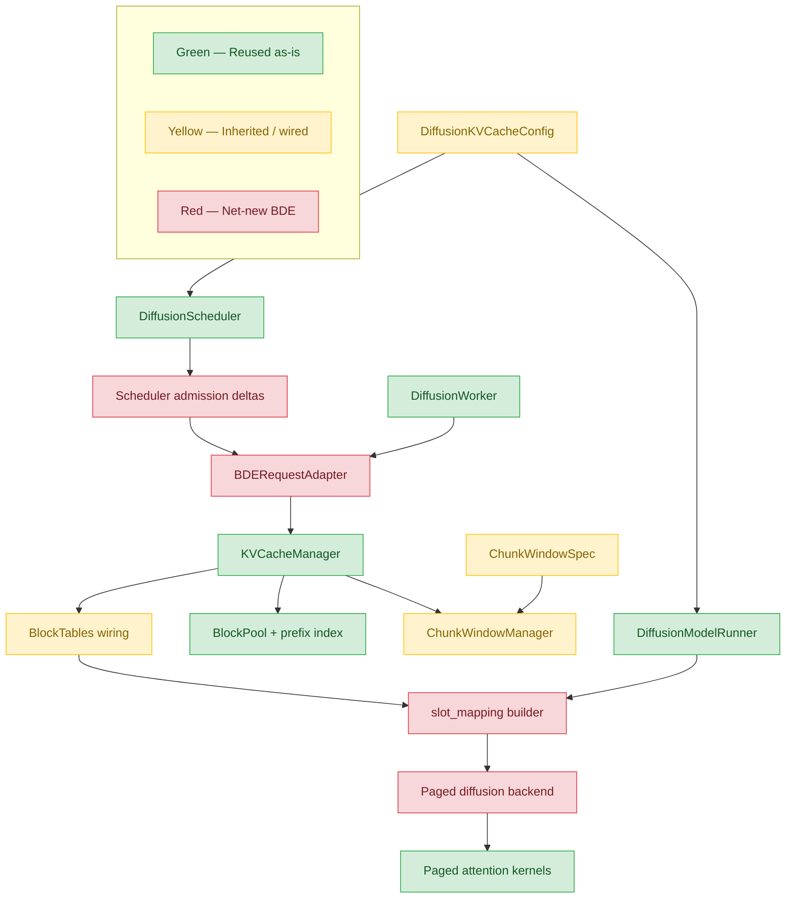
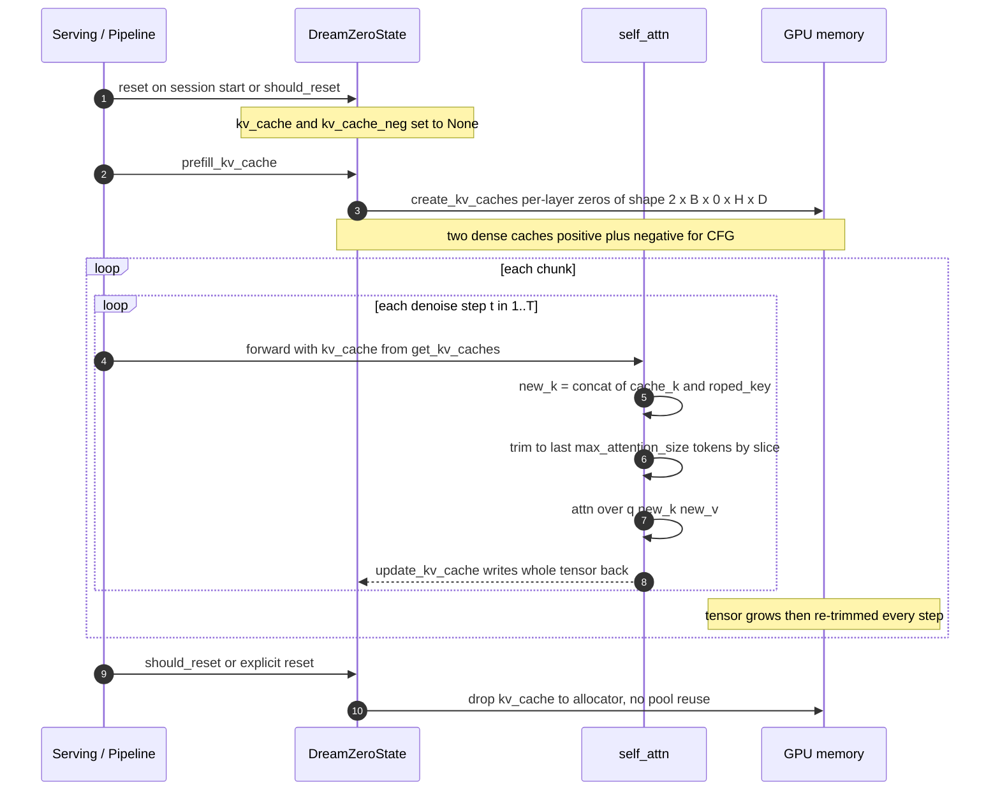
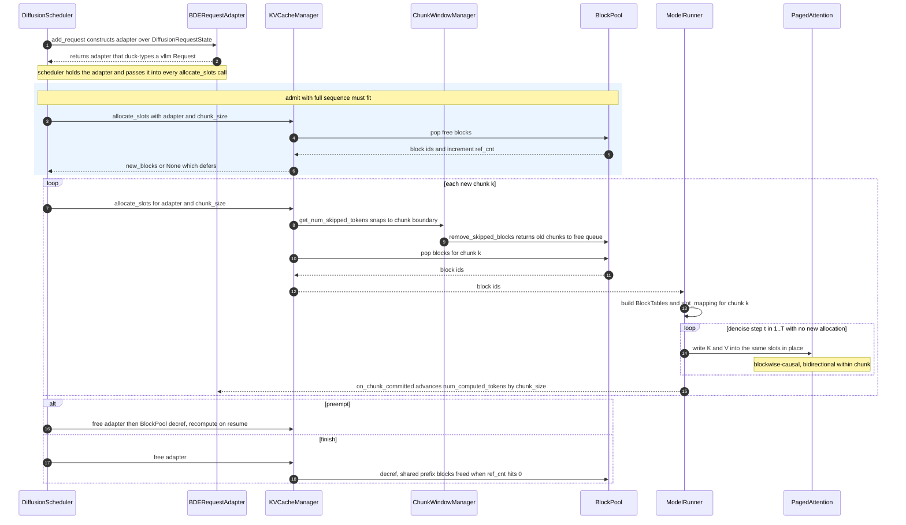

# [RFC] Unified KV Cache Management for the vLLM-Omni AR-Diffusion Engine

**Scope.** This RFC targets the **AR-Diffusion engine** — the Block Diffusion
Engine (BDE) that serves autoregressive, hybrid, and chunked blockwise-causal
diffusion models (world models, AR-DiT). Pure non-AR DiT models (Flux,
Qwen-Image, Wan, …) materialize no persistent KV and are explicitly out of
scope (see [Non-Goals](#goals-and-non-goals)).

- **Upstream RFC:**
  [World Model Support (#1987)](https://github.com/vllm-project/vllm-omni/issues/1987).
  That roadmap lists "Page-attention and KV cache management for Autoregressive
  Diffusion" under *Future*; this RFC is the design for that item.

---

## Table of Contents

- [Motivation](#motivation)
- [Background: What Exists Today](#background-what-exists-today)
- [Prior Art: FlashDreams](#prior-art-flashdreams)
- [Core Decision](#core-decision)
- [Goals and Non-Goals](#goals-and-non-goals)
- [Terminology](#terminology)
- [Proposed Design](#proposed-design)
  - [Architecture Overview](#architecture-overview)
    - [Reuse map — green / yellow / red](#reuse-map--green--yellow--red)
  - [Component 1: BDERequestAdapter](#component-1-bderequestadapter)
  - [Component 2: ChunkWindowSpec / ChunkWindowManager](#component-2-chunkwindowspec--chunkwindowmanager)
  - [Component 3: Scheduler admission deltas](#component-3-scheduler-admission-deltas)
  - [Component 4: Runner BlockTables + slot_mapping](#component-4-runner-blocktables--slot_mapping)
  - [Component 5: Paged attention (blockwise-causal)](#component-5-paged-attention-blockwise-causal)
  - [Configuration Surface](#configuration-surface)
  - [Sequence: KV management — DreamZero today vs BDE](#sequence-kv-management--dreamzero-today-vs-bde)
  - [Request Lifecycle Integration](#request-lifecycle-integration)
  - [Chunk Window Eviction Semantics](#chunk-window-eviction-semantics)
  - [T>1 Denoise Semantics](#t1-denoise-semantics)
  - [Multimodal segment alignment (audio-visual)](#multimodal-segment-alignment-audio-visual)
- [Migration of Existing Models](#migration-of-existing-models)
- [Phased Rollout](#phased-rollout)
- [Work Breakdown & Cross-Workstream Ownership](#work-breakdown--cross-workstream-ownership)
- [Alternatives Considered](#alternatives-considered)
- [Risks and Mitigations](#risks-and-mitigations)
- [Testing Plan](#testing-plan)
- [Open Questions](#open-questions)

---

## Motivation

vLLM-Omni's diffusion stack already has a mature **feature/step cache** layer
(`vllm_omni/diffusion/cache/`): TeaCache, MagCache, cache-dit (DBCache / SCM /
TaylorSeer), and a prompt-embedding cache. These all target the same goal —
**skip redundant denoise compute** by reusing block residuals or encoder
outputs across denoise steps.

What is **missing** is a managed layer for **transformer Key/Value (KV) cache**
used by the growing family of **autoregressive (AR), hybrid, and chunked
"world-model" diffusion models**. These models genuinely materialize attention
K/V tensors and reuse them — but each one does so in isolation, with hand-rolled
state living on the model module:

- **HunyuanImage3** (`models/hunyuan_image3/`): GPT-based DiT. Caches prompt /
  AR-prefix KV once (`image_kv_cache_map`, `image_kv_cache_lens`,
  `_injected_ar_kv`, `_cache_prompt_kv`) and reuses it across all denoise steps.
  TeaCache for this model is special-cased precisely because it "uses a GPT-based
  architecture with KV cache, which is incompatible with the standard hook-based
  TeaCache approach" (see `cache/teacache/backend.py`).
- **SenseNova-U1** (`models/sensenova_u1/`): uses HF `DynamicCache` with custom
  `prepare_flash_kv_cache()` / `clear_flash_kv_cache()` helpers and
  `past_key_values` threaded through `forward_und` / `forward_gen`.
- **Bagel**, **NextStep-1.1**: token-AR understanding+generation paths that also
  thread `past_key_values` / `use_cache`.
- **Chunked world-models** — the autoregressive chunk-diffusion family tracked
  by the [World Model RFC (#1987)](https://github.com/vllm-project/vllm-omni/issues/1987):
  **DreamZero** (P0 robotics world model), Matrix Game, HunYuan World, Cosmos
  WFM, LingBot-World, Genie 3. Each forward produces one video/latent chunk that
  attends **blockwise-causally** to past chunks, keeping only a **bounded window**
  of past-chunk KV alive (VGGT-style sliding replace, DreamZero-style window
  reset). This is exactly vLLM's sliding-window eviction problem, shifted from
  token granularity to chunk granularity.

### Problems with the status quo

1. **No memory accounting.** KV tensors are allocated eagerly per request and
   grow with sequence length. There is no shared budget, no
   `gpu_memory_utilization`-style sizing, and no back-pressure. Long prompts or
   high concurrency can OOM unpredictably.
2. **No cross-request reuse.** Two requests that share a conditioning prefix
   (system instruction, fixed reference image tokens, shared "negative prompt"
   for CFG) recompute identical KV every time.
3. **No cross-step contract.** The "compute conditioning KV once, reuse across
   denoise steps" idea is reinvented per model with subtly different invariants
   (`gen_timestep_scatter_index`, CFG batch layout, SP sharding).
4. **No scheduler integration.** The diffusion scheduler
   (`sched/interface.py`) tracks request lifecycle (`WAITING` / `RUNNING` /
   `PREEMPTED` / `FINISHED_*`) but has no notion of KV residency. A preempted
   request cannot release or restore KV; continuous batching cannot reason about
   KV capacity when admitting requests.
5. **No chunk-window eviction.** World-models that only keep the last `W` chunks
   alive currently free/realloc by hand. There is no allocator that understands
   "evict everything older than the window" while protecting attention sinks.
6. **Fragmentation and allocation churn.** Hand-rolled caches grow by
   `torch.cat` + slice (DreamZero) or per-request `torch.zeros`, which rewrites
   whole tensors every step and hits the CUDA allocator with frequent
   alloc/free. Under high concurrency this fragments HBM, caps the achievable
   batch size below what raw capacity allows, and produces hard-to-reproduce
   OOMs.
7. **No rollback / lookahead primitives for interactive streams.** Realtime
   world-model sessions (causal-WAN style) need to **interrupt** generation,
   **roll back** to a previous chunk boundary (e.g. user steers the rollout),
   or **speculatively look ahead**. Dense model-local tensors can only be
   truncated destructively; there is no chunk-level release/restore contract
   the scheduler can drive.
8. **Sharing breaks at the divergence point.** Even when two branches share a
   conditioning prefix (multi-reference-image requests, CFG
   positive/negative), the moment their KV **diverges** mid-sequence a dense
   layout must copy the whole prefix. Copy-on-divergence requires
   paged/segmented storage with per-block reference counting — exactly what a
   dense per-request tensor cannot express.

### Expected benefits of the new architecture

What the unified, vLLM-aligned design buys us, mapped pain-point → benefit:

| # | Pain point (above) | Benefit with paged BDE KV | Where it shows up |
| --- | --- | --- | --- |
| B1 | (2), (8) | **Prefix sharing with cheap divergence**: shared conditioning (system instruction, reference-image tokens, CFG negative branch) is computed once and shared via `ref_cnt`; when branches diverge, only post-divergence blocks are private — no prefix copy | Cloud serving: KV memory ≈ `(1−p) + p/S` of dense per request; multi-ref-image and CFG workloads |
| B2 | (1), (6) | **Less fragmentation, bigger batches**: fixed-size blocks from one pre-sized pool (`gpu_memory_utilization`-style budget) instead of per-stream worst-case dense reservations; admission control replaces OOM | Throughput per GPU at high concurrency |
| B3 | (6) | **No per-step alloc/free churn**: blocks are allocated once per chunk and written in place across `T` denoise steps; no `cat`+slice whole-tensor rewrites, far fewer CUDA allocator calls | Step latency stability; long-session memory stability |
| B4 | (5), (7) | **Chunk-level lifecycle as a scheduler contract**: dynamic KV growth (causal-WAN), window eviction, **chunk-level release / rollback / lookahead** all become block-table operations (`free` blocks past a boundary, snapshot/restore a table prefix) instead of tensor surgery | Realtime interactive sessions: interrupt, steer, re-generate |
| B5 | (3), (4) | **One contract instead of N reimplementations**: per-model hand-rolled caches (HunyuanImage3, SenseNova-U1, Bagel, NextStep) migrate onto one audited path; new AR-DiT models get KV management for free | Maintenance cost; time-to-integrate new models |
| B6 | — | **Ecosystem alignment**: staying on vLLM's `KVCacheManager`/`BlockPool` inherits prefix-cache, hybrid-allocator, KV-connector, and spill improvements upstream — and keeps the door open for an **RL training loop on top** (a `verl-omni : vllm-omni` pairing mirroring `verl : vllm`), since RL rollout engines assume vLLM's paged KV + preemption semantics | Future RL post-training (self-forcing-style rollouts); upstream feature inheritance |

Two framing notes for sizing these benefits:

- **Edge vs cloud.** A single interactive stream (edge) sees mainly B3/B4;
  B1/B2 scale with concurrency and prefix sharing, so the capacity and reuse
  wins are **cloud-serving** benefits and should be evaluated at batch.
- **B1 and B2 are independent levers.** Prefix reuse needs shared
  conditioning in the traffic; pooling/fragmentation wins need none — they
  apply to any KV-bound batch. Reporting them separately avoids the "prefix
  hit-rate is low, therefore no benefit" conflation.

## Background: What Exists Today

| Layer | Module | Purpose | Manages KV memory? |
| --- | --- | --- | --- |
| Feature/step cache | `cache/teacache`, `cache/magcache`, `cache/cache_dit_backend.py` | Skip denoise compute via residual reuse | No |
| Prompt-embed cache | `cache/prompt_embed_cache.py` | Reuse `encode_prompt` outputs across identical prompts | No (CPU/host objects) |
| Omni prefix caching | `docs/.../prefix_caching.md` | Cache stage hidden-state / mm outputs keyed by block hash (AR stages) | Mirrors vLLM KV blocks, but for **stage outputs**, not diffusion-internal KV |
| Per-model KV reuse | `models/hunyuan_image3`, `models/sensenova_u1`, `models/bagel`, `models/nextstep_1_1` | Reuse conditioning/AR KV across denoise steps | **Yes, ad-hoc, unmanaged** |

The unified `CacheBackend` ABC (`cache/base.py`) only abstracts
`enable()` / `refresh()` / `is_enabled()` for feature caches. It deliberately
does **not** model KV memory. This RFC adds a complementary subsystem; it does
not replace the feature-cache layer.

On the **vLLM mainline** side, the V1 engine already has a battle-tested,
paged KV stack we want to reuse rather than reimplement:

- `vllm/v1/core/kv_cache_manager.py` — `KVCacheManager.allocate_slots(request,
  num_new_tokens, ...)`, `free(request)`, `get_block_ids(request_id)`,
  `get_computed_blocks(request)`. This is the single allocation entry point.
- `vllm/v1/core/block_pool.py` — `BlockPool` owns the global free queue,
  `ref_cnt`, prefix-cache index, and `null_block` placeholders.
- `vllm/v1/core/single_type_kv_cache_manager.py` — `SlidingWindowManager` with
  `get_num_skipped_tokens()` / `remove_skipped_blocks()`, dispatched from a
  `spec_manager_map` keyed by `KVCacheSpec` type.
- `vllm/v1/kv_cache_interface.py` — `SlidingWindowSpec(block_size, num_kv_heads,
  head_size, dtype, sliding_window)` and `get_kv_cache_spec_kind()` which maps
  any `SlidingWindowSpec` subclass to `KVCacheSpecKind.SLIDING_WINDOW`.
- `vllm/v1/worker/gpu/block_table.py` — `BlockTables`, which turns block ids into
  the per-token `slot_mapping` consumed by paged attention kernels.

## Prior Art: FlashDreams

[NVIDIA FlashDreams](https://github.com/NVIDIA/flashdreams) is a
high-performance inference and serving framework for interactive
autoregressive video and world models. It is the closest public reference for
the execution semantics this RFC targets, especially its OmniDreams integration
and native `fp8_kvcache_cudnn` path.

FlashDreams uses a per-session autoregressive pipeline:

```python
cache = pipeline.initialize_cache(...)
for autoregressive_index, control in enumerate(controls):
    chunk = pipeline.generate(autoregressive_index, cache, input=control)
    pipeline.finalize(autoregressive_index, cache)
```

The split between `generate()` and `finalize()` is important. `generate()` is
the hot path that runs the denoise loop and returns the current video/latent
chunk. `finalize()` advances the AR/KV cache for the next chunk; FlashDreams
explicitly notes that this cache-update work can be moved off the hot path to
hide latency. This validates the BDE lifecycle rule used in this RFC: **allocate
once per chunk, reuse/overwrite during the chunk's denoise steps, and advance
`num_computed_tokens` only when the chunk is committed.**

FlashDreams also provides a direct semantic reference for chunk-window KV:
`flashdreams.core.attention.kvcache.BlockKVCache` stores KV in a fixed layout:

```text
[ sink tokens | rolling local-window tokens ]
```

Its behavior matches the BDE `ChunkWindowSpec` design:

- `sink_size` is protected and never evicted.
- `window_size` is a bounded rolling window.
- each update writes exactly one `chunk_size`;
- repeated updates with the **same** `chunk_idx` overwrite the same physical
  positions (T>1 denoise semantics), instead of appending new KV;
- when the window is full, the local window rolls left and the new chunk writes
  into the rightmost positions.

OmniDreams' native accelerated path further reinforces the target performance
shape: its default performance profile uses `native_dit_backend =
"fp8_kvcache_cudnn"` and a cuDNN attention backend, with cache geometry derived
from `len_t`, `window_size_t`, and `sink_size_t`. Its WebRTC runtime keeps a
warm session alive, generates one chunk per control interval, and resets the
rollout/cache only when a new session starts. This is the strongest prior-art
signal for making BDE's realtime world-model KV lifetime **session-scoped by
default**, not per-turn.

The key difference is ownership. FlashDreams owns its cache tensors inside the
framework (`BlockKVCache` per rollout/session). BDE should **not** copy that
allocator design into vLLM-Omni. Instead, BDE reuses vLLM's `KVCacheManager`,
`BlockPool`, prefix-cache refcounts, admission gates, and worker `BlockTables`.
FlashDreams is therefore a semantic and lifecycle reference, while vLLM remains
the memory-management authority.

### StreamDiffusionV2

[StreamDiffusionV2](https://github.com/chenfengxu714/StreamDiffusionV2) is an
interactive streaming diffusion system for real-time video-to-video generation.
It is less directly aligned with vLLM serving than FlashDreams, but it contains
two useful implementation references for BDE: a **ring-buffer KV cache** for
sliding-window causal video attention, and a distributed KV-owner rebalance path
for multi-GPU streaming. The latter is **not** a v1 requirement for BDE: vLLM's
existing static pipeline parallelism already keeps each rank's layer-local KV in
place and passes activations between ranks. Rebalance only becomes relevant if a
future world-model runtime allows KV block ownership itself to change across
ranks or nodes.

The single-GPU path exposes a staged loop:

```python
stream.prepare(prompt)
for video_chunk in stream.chunk_video(video):
    encoded = stream.encode_chunk(video, video_chunk, ...)
    denoised = stream.denoise_chunk(encoded)
    if denoised is not None:
        decoded_chunks.append(stream.decode_chunk(denoised))
```

Internally, the causal Wan model stores per-layer KV in dense dictionaries:

```python
kv_cache = {
    "k": ...,
    "v": ...,
    "global_end_index": ...,
    "local_end_index": ...,
    "total_steps": ...,
    "current_step": ...,
}
```

and maintains an `evict_idx` queue for ring-buffer slot reuse. Once the local
KV window is full, new chunk KV overwrites the oldest reusable slot instead of
physically rolling the whole cache. This is an important distinction for BDE:
the logical chunk window can advance while the physical storage is recycled via
block-table / slot-mapping updates. In other words, BDE should describe window
eviction as **logical visibility over vLLM blocks**, not as a required dense
tensor roll.

StreamDiffusionV2 also has explicit T>1 denoise protection. Its cache tracks
`current_step` and `total_steps`; repeated denoise passes for the same chunk do
not pop the eviction queue on every pass. Only after the chunk's denoise group
is complete does the ring buffer advance. This independently validates BDE's
rule that repeated denoise steps for the same chunk overwrite the same slots,
and `num_computed_tokens` advances only at chunk commit.

Two additional ideas are useful but should remain out of the BDE v1 main path:

- **Adaptive sink refresh.** StreamDiffusionV2 optionally compares the average
  cosine similarity between new K/V and sink K/V (`adapt_sink_threshold`) and
  refreshes low-similarity sink positions. This is promising for long-running
  sessions, but complicates vLLM prefix sharing and refcounts, so BDE should
  keep fixed sinks in v1 and list adaptive sinks as future work.
- **Dynamic KV-owner rebalance.** Its distributed
  `KVCacheManager.compute_block_owners()` /
  `rebalance_kv_cache_by_diff()` / `broadcast_kv_blocks()` path tracks block
  interval ownership across ranks and broadcasts moved KV blocks from old owner
  to new owner. This should not be confused with normal vLLM PP, where layer
  ownership is static and historical KV stays on the rank that owns the layer.
  For BDE, this is only prior art for a future mode with dynamic rank ownership
  or cross-node KV movement; the default should rely on vLLM's PP/KV-connector
  abstractions rather than copying this mechanism.

As with FlashDreams, StreamDiffusionV2 should be treated as a **semantic and
systems-pattern reference**, not copied as the allocator. BDE still delegates
allocation, admission, prefix refcounting, and worker block tables to vLLM.

### AR-DiT ecosystem survey

Beyond FlashDreams and StreamDiffusionV2, there is now a small but fast-moving
open-source ecosystem around AR-DiT / causal video diffusion inference. These
projects validate the core workload BDE is targeting, but most of them still
manage KV as model-local dense tensors or method-specific cache state. BDE's
contribution is to bring the same semantics into vLLM's shared KV allocator,
scheduler, and paged-attention stack.

| Project | What it contributes | Relevance to BDE |
| --- | --- | --- |
| [CausVid](https://github.com/tianweiy/CausVid) | Converts a bidirectional video DiT into a causal / autoregressive generator via DMD-style distillation; provides autoregressive and long-video inference scripts with KV caching. | Baseline AR-DiT inference semantics: causal rollout, few-step denoise, long-video sliding-window inference. |
| [Self-Forcing](https://self-forcing.github.io/) | Trains AR video diffusion by simulating inference rollout with KV caching, reducing train-test exposure bias. | Supports BDE's chunk-commit rule: cache state should advance according to generated context, not teacher-forced future tokens. |
| [Causal-Forcing](https://github.com/thu-ml/Causal-Forcing) | Successor to CausVid / Self-Forcing with chunk-wise and frame-wise models for real-time interactive video generation. | Useful for model-surface coverage: BDE should not assume only chunk-wise AR; frame-wise AR is another valid adapter target. |
| [Rolling Forcing](https://github.com/TencentARC/RollingForcing) | Long-video AR diffusion with rolling-window denoising and attention sinks for multi-minute streaming generation. | Strong reference for fixed sink + rolling window semantics and long-running session behavior. |
| [FastVideo](https://github.com/hao-ai-lab/FastVideo) | Unified video diffusion inference / post-training framework; includes causal Wan stages with KV and cross-attention cache state. | Reference for integrating causal AR inference into a general video-serving pipeline rather than a one-off script. |
| [MAGI-1](https://github.com/SandAI-org/MAGI-1) | Large-scale open-source AR video model generating fixed-size chunks (24 frames), with scalable attention infrastructure. | Future reference for high-throughput chunk pipelines and distributed / long-context attention, not a v1 allocator model. |
| [Forcing-KV](https://github.com/zju-jiyicheng/Forcing-KV) | Inference-side toolkit for hybrid KV cache compression across Self-Forcing, LongLive, Causal Forcing, Rolling Forcing, and others. | Future work for KV compression / memory reduction policies once BDE's base BlockPool integration is stable. |

Design implication: the ecosystem converges on **causal / chunked rollout with
KV caching**, but not on a common allocator. This strengthens the RFC's core
decision: vLLM-Omni should not add another model-local KV cache. It should
normalize these AR-DiT patterns onto vLLM's `KVCacheManager`, `BlockPool`,
`BlockTables`, and scheduler admission path.

## Core Decision

> **Reuse vLLM mainline KV management; build the missing compatibility layer in
> the diffusion engine. Do NOT build a parallel diffusion-local allocator.**

Concretely, the diffusion engine adopts vLLM's `KVCacheManager` / `BlockPool` /
`BlockTables` / paged-attention path, and we add only the glue that the
diffusion runtime is missing today:

```text
Primary plan:
  Extend the diffusion step engine so it can drive vLLM's
  KVCacheManager.allocate_slots() and BlockTables, instead of hand-rolling KV.

New compatibility layers (the deliverables of this RFC):
  1. BDERequestAdapter        — make a diffusion request look like vllm Request
  2. ChunkWindowSpec          — a SlidingWindowSpec variant (chunk granularity)
     ChunkWindowManager       — extends SlidingWindowManager, registered in
                                spec_manager_map
  3. Scheduler admission deltas — give the diffusion scheduler token-like
                                  num_new_tokens / num_computed_tokens so it can
                                  gate on KV capacity
  4. Runner BlockTables + slot_mapping integration
  5. Paged attention backend, blockwise-causal (causal=False over present blocks)
```

The previously-proposed `DiffusionKVCacheManager` (a new diffusion-local block
pool + prefix index + profiler + eviction policy) is **rejected** and moved to
[Alternatives](#alternatives-considered): it would fork a second allocator,
refcount model, prefix index, and eviction policy that we would then have to
keep in sync with vLLM forever.

**Library-level reuse, not framework reuse.** A review comment
([BDE_doc #1](https://github.com/tzhouam/BDE_doc/issues/1)) suggested a lighter
variant — let the runner import only the block table and paged kernels, keeping
everything else independent — on the assumption that this RFC adopts vLLM's
scheduler/runner as frameworks. To be explicit: it does not. The diffusion
scheduler and `DiffusionModelRunner` remain fully independent and own the
execution path; they *call into* `KVCacheManager.allocate_slots()/free()` as a
**library**, through `BDERequestAdapter`. What distinguishes this from the
"block table + kernels only" variant is precisely the manager layer: dropping
`KVCacheManager`/`BlockPool` also drops `ref_cnt` (prefix/CFG sharing), the
prefix index, and the admission gate (`full_sequence_must_fit`) — i.e. benefits
B1/B2 — and re-creates the rejected diffusion-local route (see
[Alternative 7](#alternatives-considered)).

## Goals and Non-Goals

### Goals

- **Reuse**, not reimplement, vLLM's `KVCacheManager`, `BlockPool`,
  `SlidingWindowManager`, `BlockTables`, and paged attention kernels.
- A `BDERequestAdapter` that satisfies the subset of the `vllm.v1.request.Request`
  contract that `KVCacheManager` actually touches (see
  [Component 1](#component-1-bderequestadapter)).
- A `ChunkWindowSpec` (subclass of `SlidingWindowSpec`) + `ChunkWindowManager`
  (subclass of `SlidingWindowManager`) for **chunk-granularity** window eviction,
  registered in vLLM's `spec_manager_map`.
- Diffusion-scheduler **admission deltas** so continuous batching can gate on KV
  capacity and free/restore on preempt/finish.
- Runner-side `BlockTables` + `slot_mapping` wiring so attention reads/writes the
  paged KV pool.
- A migration path that lets HunyuanImage3 / SenseNova-U1 / Bagel / NextStep drop
  their bespoke caches without behavior changes.

### Non-Goals

- Not changing or replacing the feature/step caches (TeaCache, MagCache,
  cache-dit). They remain orthogonal and composable.
- Not building a new diffusion-local KV allocator / block pool / prefix index.
  We reuse vLLM's (this is the explicit reversal vs the earlier draft).
- Not engaging the manager for pure DiT models with no KV (Flux, Qwen-Image,
  Wan, Z-Image, …). The adapter is simply never constructed for them.
- Not solving multi-node KV transfer in v1 (left to a later phase that can reuse
  the existing Omni connector layer + vLLM's KV connector hooks).

## Terminology

- **AR-Diffusion engine / BDE (Block Diffusion Engine)**: the vLLM-Omni
  execution engine for **autoregressive** diffusion — models that generate
  chunk-by-chunk with blockwise-causal attention and persistent KV (world
  models, AR-DiT, hybrid AR+DiT). This RFC's subject; "BDE" throughout refers
  to this engine.
- **DiT**: Diffusion Transformer (denoiser run N times over the latent).
- **AR/hybrid model**: a model whose denoiser is a causal/GPT-style transformer
  that maintains attention KV (e.g. HunyuanImage3).
- **Chunk**: the KV-accounting unit for autoregressive generation in a
  world-model: the set of persistent self-attention tokens materialized when the
  model advances by one causal attention block. `chunk_size` tokens per chunk.
  For DreamZero, this maps to `num_frame_per_block * frame_seqlen`, not to one
  OpenPI serving request or the outer 4-frame observation bundle
  (`FRAMES_PER_CHUNK`). The first-frame prefill is a special prefix of
  `frame_seqlen` tokens, and action/state registers are per-forward tokens that
  participate in attention but are not part of the persistent self-attention KV.
- **Chunk window**: the last `W` chunks whose KV is kept resident
  (`sliding_window = W * chunk_size`).
- **Blockwise-causal attention** (#1987 term): a chunk attends causally to all
  past chunks and bidirectionally within itself. We realize cross-chunk
  causality via block-table membership and intra-chunk bidirectionality via
  `causal=False` (see [Component 5](#component-5-paged-attention-blockwise-causal)).
- **Conditioning KV**: K/V for tokens constant across all denoise steps of a
  request (text prompt, reference-image tokens, AR prefix). Prime reuse target.
- **Denoise step**: one transformer forward over the (noisy) latent;
  `ForwardContext.denoise_step_idx` already tracks this.
- **CFG branch**: positive (conditional) vs negative (unconditional) batch rows
  when `do_classifier_free_guidance` is set.

## Proposed Design

### Architecture Overview

```
                    OmniDiffusionConfig.kv_cache_config
                                  │
        ┌─────────────────────────┼──────────────────────────┐
        │                         │                           │
  DiffusionScheduler        DiffusionWorker            DiffusionModelRunner
  (sched/*.py)              (worker/diffusion_worker)  (worker/diffusion_model_runner)
        │                         │                           │
        │ admission deltas        │ owns                      │ per-step:
        │ (num_new_tokens,        │                           │  build BlockTables
        │  num_computed_tokens)   ▼                           ▼  + slot_mapping
        │            ┌──────────────────────────────────────────────┐
        │            │   BDERequestAdapter (looks like vllm Request)  │
        └──────────▶ └──────────────────────────────────────────────┘
                                  │  passed to
                                  ▼
                ┌─────────────────────────────────────────────────────┐
                │     vLLM mainline KV stack (REUSED, not forked)       │
                │  KVCacheManager.allocate_slots() / free()             │
                │  BlockPool (free queue, ref_cnt, null_block)          │
                │  ChunkWindowManager  ⊂ SlidingWindowManager           │
                │     keyed by ChunkWindowSpec ⊂ SlidingWindowSpec      │
                └─────────────────────────────────────────────────────┘
                                  │ block ids
                                  ▼
                          BlockTables → slot_mapping
                                  │
                                  ▼
          paged attention (blockwise-causal: causal=False over present blocks)
```

#### Reuse map — green / yellow / red

<a id="reuse-map--green--yellow--red"></a>
Three categories describe every box in the stack. Use this map when scoping work
packages or reviewing PRs: green items should stay import-only; yellow items
subclass or extend vLLM types; red items are net-new BDE glue.

| Color | Label | Rule |
| --- | --- | --- |
| <span style="background:#d4edda;color:#155724;padding:2px 8px;border-radius:4px;font-weight:600">Green — Reused</span> | **Reused as-is** | Imported from vLLM mainline (or already in the BDE engine) and **called without fork or subclass**. Memory policy, refcounting, prefix index, and kernels live here. |
| <span style="background:#fff3cd;color:#856404;padding:2px 8px;border-radius:4px;font-weight:600">Yellow — Inherited</span> | **Extended / wired** | **Subclasses** a vLLM spec or manager, or **plugs an existing vLLM type** into a new diffusion call path (config extension, `spec_manager_map` registration, runner wiring). |
| <span style="background:#f8d7da;color:#721c24;padding:2px 8px;border-radius:4px;font-weight:600">Red — New</span> | **Net-new BDE** | No vLLM superclass — new modules, scheduler hooks, or attention backends that make the library call possible. |

| Layer | Component | Color | Rationale |
| --- | --- | --- | --- |
| **Config** | `DiffusionKVCacheConfig` + `OmniDiffusionConfig.kv_cache_config` field | Yellow | Extends existing `OmniDiffusionConfig`; new dataclass, existing config plumbing. |
| **Engine (unchanged)** | `DiffusionScheduler`, `DiffusionWorker`, `DiffusionModelRunner` | Green | Existing BDE execution path; **not** embedded in vLLM's LLM scheduler/runner. |
| **Engine (unchanged)** | `DiffusionRequestState` / `OmniDiffusionRequest` | Green | Existing request objects; adapter reads them, does not replace them. |
| **Compatibility** | `BDERequestAdapter` | Red | Duck-types the subset of `vllm Request` that `KVCacheManager` reads; no vLLM base class. |
| **Compatibility** | Scheduler admission deltas (`num_new_tokens`, preempt/finish `free()`) | Red | New bookkeeping hooks in `sched/*.py`; vLLM scheduler is not reused. |
| **Compatibility** | Runner `slot_mapping` builder + per-chunk table refresh | Red | New glue in `diffusion_model_runner`; turns block ids into kernel indices each chunk. |
| **Compatibility** | Paged diffusion attention backend (`causal=False`, blockwise-causal) | Red | New backend module wrapping reused paged kernels; today's `AttentionImpl` has no `block_table` arg. |
| **vLLM KV manager** | `KVCacheManager.allocate_slots()` / `free()` / `get_computed_blocks()` | Green | Called as a **library** through the adapter; unmodified. |
| **vLLM KV manager** | `BlockPool` (free queue, `ref_cnt`, `null_block`, prefix index) | Green | Shared pool; BDE does not fork allocator or refcount model. |
| **vLLM KV manager** | Prefix-cache hash lookup + shared-block `ref_cnt` (Phase 3) | Green | Reuses vLLM prefix index; BDE only supplies `block_hashes` via adapter. |
| **vLLM KV manager** | `ChunkWindowSpec` | Yellow | Subclass of `SlidingWindowSpec`; adds `chunk_size`, `window_chunks`, `sink_chunks`, `reset_at_boundary`. |
| **vLLM KV manager** | `ChunkWindowManager` | Yellow | Subclass of `SlidingWindowManager`; overrides `get_num_skipped_tokens` for chunk-boundary eviction. |
| **vLLM KV manager** | `spec_manager_map[ChunkWindowSpec] = ChunkWindowManager` | Yellow | Uses vLLM's existing registration hook; new key/value pair only. |
| **vLLM worker** | `BlockTables` (`vllm/v1/worker/gpu/block_table.py`) | Yellow | vLLM class; **new** diffusion-side ownership and rebuild cadence (each chunk). |
| **vLLM kernels** | Paged attention / FlashAttention paged write path | Green | Kernel code reused; semantics (`causal=False`, present-block mask) owned by red backend. |
| **Orthogonal** | Feature/step caches (TeaCache, MagCache, cache-dit) | Green | Unchanged; composable with KV manager, not replaced by it. |
| **Future** | `AttentionSegment` + per-modality `KVCacheGroup` (OmniForcing) | Yellow / Red | Segments are a new logical dataclass (red); map onto existing `KVCacheGroupSpec` (green/yellow). Cross-group composed block table for A2V/V2A is red. |



Everything inside the dashed "vLLM mainline KV stack" box in the ASCII diagram
is **green or yellow** (import + subclass). The four outward-facing glue pieces
(`BDERequestAdapter`, scheduler deltas, runner `BlockTables`/`slot_mapping`
wiring, paged backend) are **red**. The manager/pool/kernel core stays green so
B1/B2 benefits (prefix sharing, admission gate) are not lost — see
[Alternative 7](#alternatives-considered).

### Component 1: BDERequestAdapter

`KVCacheManager.allocate_slots(request, ...)` and `get_computed_blocks(request)`
operate on a `vllm.v1.request.Request`. The diffusion engine instead has
`DiffusionRequestState` (`sched/interface.py`) wrapping an
`OmniDiffusionRequest`, which has **no** `num_computed_tokens`, `num_tokens`, or
`block_hashes`. The adapter bridges exactly the attributes the KV manager reads
— nothing more.

From reading `allocate_slots` / `get_computed_blocks`, the touched surface is:

| Attribute / method | Used by | Diffusion meaning |
| --- | --- | --- |
| `request_id` | block ownership keying | `DiffusionRequestState.request_id` |
| `num_computed_tokens` | computed-prefix length | chunk tokens already materialized (`completed_chunks * chunk_size`) |
| `num_tokens` | cache-commit cap, full-fit gate | total tokens once the current chunk lands |
| `block_hashes` | prefix-cache lookup | conditioning-prefix hash blocks; empty when caching disabled |
| `skip_reading_prefix_cache` | bypass prefix lookup | `True` until prefix reuse is enabled (Phase 3) |
| `num_preemptions` | stats only | from scheduler preempt counter |

```python
# vllm_omni/diffusion/kv_cache/adapter.py  (proposed)

class BDERequestAdapter:
    """Adapts a diffusion request to the subset of vllm Request that
    KVCacheManager.allocate_slots()/get_computed_blocks() actually reads.

    NOT a full Request: it only implements the attributes exercised by the
    KV manager. A conformance test asserts the touched attribute set does not
    drift (see Testing Plan)."""

    def __init__(self, state: DiffusionRequestState, *, chunk_size: int):
        self._state = state
        self._chunk_size = chunk_size
        self._completed_chunks = 0
        self._block_hashes: list = []          # filled only when prefix reuse on

    @property
    def request_id(self) -> str:
        return self._state.request_id

    @property
    def num_computed_tokens(self) -> int:
        return self._completed_chunks * self._chunk_size

    @property
    def num_tokens(self) -> int:
        # tokens once the in-flight chunk is committed
        return (self._completed_chunks + 1) * self._chunk_size

    @property
    def block_hashes(self):
        return self._block_hashes

    @property
    def skip_reading_prefix_cache(self) -> bool:
        return True                            # Phase 3 flips this on

    @property
    def num_preemptions(self) -> int:
        return 0

    def on_chunk_committed(self) -> None:
        self._completed_chunks += 1
```

The adapter is **not** registered as a vLLM `Request`; it is a structural
duck-type. To keep this honest, a unit test introspects which `Request`
attributes `allocate_slots` / `get_computed_blocks` reference (via a recording
proxy) and fails if the adapter is missing one.

### Component 2: ChunkWindowSpec / ChunkWindowManager

World-models keep only the last `W` chunks of KV. That is a sliding window whose
unit is a chunk, so we express it as a `SlidingWindowSpec` with
`sliding_window = W * chunk_size`, and subclass the manager to evict at chunk
boundaries.

```python
# vllm_omni/diffusion/kv_cache/chunk_window.py  (proposed)

from vllm.v1.kv_cache_interface import SlidingWindowSpec
from vllm.v1.core.single_type_kv_cache_manager import (
    SlidingWindowManager, spec_manager_map,
)

@dataclass(frozen=True, kw_only=True)
class ChunkWindowSpec(SlidingWindowSpec):
    # sliding_window (inherited) MUST equal window_chunks * chunk_size.
    chunk_size: int
    window_chunks: int
    sink_chunks: int = 0          # protected leading chunks (attention sink)
    reset_at_boundary: bool = False   # True => DreamZero window-reset semantics

    def __post_init__(self):
        super().__post_init__()
        assert self.sliding_window == self.window_chunks * self.chunk_size


class ChunkWindowManager(SlidingWindowManager):
    """Chunk-granularity eviction on top of SlidingWindowManager.

    Reuses BlockPool's free queue, ref_cnt, and null_block replacement. Only the
    'which tokens are skipped' math is overridden so eviction snaps to chunk
    boundaries and honors sink_chunks."""

    def get_num_skipped_tokens(self, num_computed_tokens: int) -> int:
        spec: ChunkWindowSpec = self.kv_cache_spec
        sink = spec.sink_chunks * spec.chunk_size
        if spec.reset_at_boundary:
            # Window reset: at each chunk boundary everything past sink is dropped.
            completed = (num_computed_tokens // spec.chunk_size) * spec.chunk_size
            return max(0, completed - sink)
        # Sliding replace: keep last `window_chunks` chunks (+ sink).
        # Base SlidingWindowManager uses `- sliding_window + 1` to keep the
        # in-flight token's window intact. Because chunks are block-aligned and
        # we snap the skip count down to a chunk boundary, that ±1 is absorbed:
        # we never skip into a chunk that the current window still needs.
        keep = spec.sliding_window
        skipped = max(0, num_computed_tokens - keep - sink)
        # snap down to a chunk boundary so we never half-evict a chunk
        return (skipped // spec.chunk_size) * spec.chunk_size


# Register so KVCacheManager dispatches ChunkWindowSpec to ChunkWindowManager.
# Dispatch is by EXACT type (`spec_manager_map[type(kv_cache_spec)]`), so the
# subclass must be registered explicitly — inheritance alone is not enough.
spec_manager_map[ChunkWindowSpec] = ChunkWindowManager
```

Why this plugs in cleanly:

- `get_kv_cache_spec_kind()` already maps **any** `SlidingWindowSpec` subclass to
  `KVCacheSpecKind.SLIDING_WINDOW` (the `isinstance(spec, SlidingWindowSpec)`
  branch), and `SlidingWindowManager`'s cache-hit path asserts
  `SlidingWindowSpec` — both satisfied by inheritance.
- `remove_skipped_blocks()` (the eviction driver called from `allocate_slots`)
  is inherited; we only override the token-skip math. Eviction therefore still
  goes through `BlockPool`'s single free queue and `null_block` replacement — no
  parallel `_expired_pool`.
- `max_admission_blocks_per_request()` is inherited from `SlidingWindowSpec` and
  bounds pool sizing/admission to the window size, which is exactly the
  world-model invariant.

**Sink protection:** sinks are tracked as the leading `sink_chunks` blocks and
excluded from the skip count above, so `BlockPool` never reclaims them while the
request lives. (The earlier draft tracked relative indices; tracking the leading
chunk count is equivalent and avoids `null_block` index drift.)

### Component 3: Scheduler admission deltas

`KVCacheManager.allocate_slots(request, num_new_tokens, ...)` needs a
**token-like delta**. The diffusion scheduler today emits only request ids
(`DiffusionSchedulerOutput.scheduled_request_ids`) with no per-request token
count. We add the minimal accounting:

- `num_new_tokens` means "how many persistent KV tokens this admission will
  materialize", not "how many text tokens were decoded". For chunked world
  models, the normal value is `chunk_size`.
- DreamZero-specific mapping: for a regular causal attention block,
  `num_new_tokens = chunk_size = num_frame_per_block * frame_seqlen`. The
  first-frame prefill is a special prefix with `num_new_tokens = frame_seqlen`.
  Action/state registers are per-forward tokens and are not counted in
  `num_new_tokens` because they are not appended to persistent self-attention KV.
- On admit / each new chunk, the adapter's `num_computed_tokens` reflects
  already-committed persistent KV (`completed_chunks * chunk_size`, plus any
  model-specific prefill prefix). The scheduler calls `allocate_slots(adapter,
  num_new_tokens=..., full_sequence_must_fit=...)` before the request enters the
  running batch. A `None` return means "not enough free blocks" → defer/preempt,
  mirroring vLLM's scheduler.
- For `T > 1` denoise, only the first step for a chunk allocates slots. Steps
  `1..T-1` use `num_new_tokens = 0` and reuse the same `slot_mapping`; the
  adapter advances `num_computed_tokens` only once, when the chunk is committed.
- This is bookkeeping only; it does not change diffusion's fixed step-count
  execution model. It moves KV-capacity failure to scheduler admission instead
  of discovering OOM inside the model forward.

### Component 4: Runner BlockTables + slot_mapping

After `allocate_slots` returns blocks, the runner must turn them into the
per-token `slot_mapping` the attention kernel writes/reads through. We reuse
`vllm/v1/worker/gpu/block_table.py`:

```python
# in DiffusionModelRunner, per scheduled chunk
blocks = kv_cache_manager.allocate_slots(adapter, num_new_tokens=chunk_size)
if blocks is None:
    # back-pressure: scheduler defers this request
    ...
block_ids = kv_cache_manager.get_block_ids(adapter.request_id)
bde_block_tables.append_block_ids(req_index, block_ids)     # worker-side view
slot_mapping = bde_block_tables.compute_slot_mapping(positions)
# slot_mapping + the paged kv_cache tensor go into ForwardContext / attn metadata
```

**Known gap (called out, not hand-waved):** the worker `BlockTables` view does
not automatically observe scheduler-side `null_block` replacements from
eviction. The runner must re-pull `get_block_ids()` (or apply the same skip) each
chunk and rebuild `slot_mapping`, otherwise evicted blocks would still be read.
This is a concrete work item in Phase 2, not an assumption.

### Component 5: Paged attention (blockwise-causal)

The [World Model RFC (#1987)](https://github.com/vllm-project/vllm-omni/issues/1987)
specifies the attention for autoregressive chunk diffusion as **blockwise
causal**: each forward produces one chunk that attends to **all past chunks**
(causal across chunks) while being **bidirectional within the chunk** (full
attention among the chunk's own tokens). This is exactly the mask shape we must
support, and it maps cleanly onto vLLM's paged path:

- **Across chunks (causal):** enforced structurally, not by a token mask. A
  chunk's block table contains only past + current chunks (future chunks are not
  generated yet), and `ChunkWindowManager` further trims it to the resident
  window. The kernel never sees future-chunk KV, so cross-chunk causality is
  free.
- **Within a chunk (bidirectional):** the current chunk's query tokens must see
  each other fully, so the per-forward mask over the **present** blocks is
  **non-causal** (`causal=False`). Setting `causal=True` would wrongly impose a
  triangular mask *inside* the chunk.

So "blockwise causal" decomposes into "`causal=False` over the blocks that are
present in the table." That is why the block manager (Components 2 & 4) does the
heavy lifting and the kernel runs with `causal=False`.

The diffusion `AttentionImpl.forward(query, key, value, attn_metadata)` signature
(`attention/backends/abstract.py`) takes K/V tensors directly and has **no
`kv_cache` / `block_table` parameter today**. So "reuse paged attention" is not
free — it requires a backend that:

1. accepts the paged `kv_cache` tensor + `block_table` + `slot_mapping`
   (threaded through `AttentionMetadata.extra` or a new typed field), and
2. runs with `causal=False` (`AttentionImpl.__init__` already exposes
   `causal: bool = False`).

So the v1 integration adds a **paged diffusion attention backend** (wrapping
vLLM's paged kernel) selected when `kv_cache_config.enable` is set. The existing
dense backends remain the default for pure-DiT / cache-off paths.

> KV **management** (who owns blocks, when they are evicted) is fully delegated
> to vLLM. Attention **semantics** (blockwise-causal: cross-chunk causality via
> block-table membership, intra-chunk bidirectional `causal=False`, null-hole
> handling, position ids) are a separate concern owned by the backend and are
> NOT solved by the block manager.

### Configuration Surface

Extend `OmniDiffusionConfig` (`diffusion/data.py`), which already carries
`cache_backend` / `cache_config`:

```python
@dataclass
class OmniDiffusionConfig:
    ...
    cache_backend: str = "none"                       # feature/step cache (existing)
    cache_config: DiffusionCacheConfig | dict = field(default_factory=dict)
    # NEW: transformer KV cache management (reuses vLLM stack)
    kv_cache_config: DiffusionKVCacheConfig | dict = field(default_factory=dict)

@dataclass
class DiffusionKVCacheConfig:
    enable: bool = False
    chunk_size: int = 0               # tokens per AR chunk (0 => single prefill)
    window_chunks: int | None = None  # None => full attention (no eviction)
    sink_chunks: int = 0
    reset_at_boundary: bool = False
    gpu_memory_fraction: float = 0.1
    enable_prefix_reuse: bool = False # cross-request conditioning reuse (Phase 3)
```

When `enable=False` (default), behavior is **byte-for-byte the current path** —
models keep their existing code until migrated. The RFC is strictly additive at
first.

### Sequence: KV management — DreamZero today vs BDE

The two diagrams below contrast how KV cache is **allocated, updated, windowed,
and freed** in the current DreamZero model-local path versus the proposed BDE
path that reuses vLLM's paged KV stack. They are grounded in the real code:
`vllm_omni/diffusion/models/dreamzero/state_dreamzero.py`
(`create_kv_caches` / `update_kv_cache` / `reset`) and
`causal_wan_model.py` (`self_attn` rolling `cat` + `[-max_attention_size:]`
slice) for the "today" side, and `KVCacheManager` / `BlockPool` /
`ChunkWindowManager` for the "proposed" side.

#### Today — DreamZero model-local dense rolling KV

KV lives **inside the model state object**, one dense contiguous tensor per
layer, grown by `torch.cat` and trimmed by a tensor slice every denoise step.
The window is enforced by slicing; there is no pool, no paging, and no
cross-request sharing. CFG keeps a **second** full copy (`kv_cache_neg`).



Pain points this makes visible: the per-step `cat`+slice rewrites the whole
layer tensor (allocation churn), the window is a model-private convention not a
scheduler contract, CFG doubles memory, and freed memory returns to the
allocator rather than a reusable block pool — so no cross-request prefix sharing
is possible.

#### Proposed — BDE over vLLM paged KV

KV blocks come from a **shared `BlockPool`**; the diffusion request is presented
to the unmodified `KVCacheManager` via `BDERequestAdapter`. Windowing is a
scheduler-level contract enforced by `ChunkWindowManager` (evict at chunk
boundaries, blocks returned to the free queue), and `T>1` denoise reuses the
**same** slots in place.



#### Diagram walkthrough: BDE KV lifecycle

The step numbers below follow the rendered `autonumber` sequence diagram.

**Stage 1 — Request entry (steps 1–2).**

1. **`add_request` constructs adapter over `DiffusionRequestState`:**
   the scheduler constructs a `BDERequestAdapter` for the new request. The
   adapter starts with `num_computed_tokens = 0`. It is a structural duck-type,
   not a real vLLM `Request`; it only implements the fields the KV manager reads
   (`request_id`, `num_computed_tokens`, `num_tokens`, `block_hashes`,
   `skip_reading_prefix_cache`, `num_preemptions`, etc.).
2. **Adapter returns the decorated request view:** the adapter is handed back to
   the scheduler. The scheduler holds this same object and passes it into every
   later `allocate_slots()` / `free()` call. This makes the adapter the
   request-lifetime bridge between diffusion state and vLLM's KV manager.

**Stage 2 — Admission gate (blue `rect`, steps 3–6).**

This block corresponds to `full_sequence_must_fit=True`: the request is admitted
only if the KV cache can hold the required sequence after accounting for prefix
cache hits and window eviction. If it cannot fit, the request is deferred rather
than admitted and later forced into preemption or OOM.

3. **`allocate_slots` with adapter and `chunk_size`:** the scheduler asks
   `KVCacheManager` to allocate slots for the request, using the adapter as the
   vLLM-compatible request view.
4. **`pop free blocks`:** `KVCacheManager` asks `BlockPool` for free physical
   KV blocks.
5. **`block ids and increment ref_cnt`:** `BlockPool` returns block ids and
   increments their reference counts. `ref_cnt` is what later makes shared
   prefix / CFG reuse and safe release possible.
6. **`new_blocks or None which defers`:** `KVCacheManager` returns the allocated
   blocks, or `None` if the request cannot fit. `None` means the scheduler
   defers the request and does not force it into the running set.

**Stage 3 — Per-chunk generation (`loop each new chunk k`, steps 7–15).**

This is the core loop. Every newly generated chunk follows the same sequence:
first release blocks that fell outside the chunk window, then allocate blocks
for the current chunk, then run `T` denoise steps on the same slots.

7. **`allocate_slots` for adapter and `chunk_size`:** request slots for chunk
   `k`.
8. **`get_num_skipped_tokens` snaps to chunk boundary:** `KVCacheManager` calls
   `ChunkWindowManager` to compute how many tokens/chunks are now outside the
   window. The result snaps to chunk boundaries so a chunk is never half-evicted.
9. **`remove_skipped_blocks` returns old chunks to free queue:** blocks belonging
   to out-of-window chunks are returned to `BlockPool`. This happens before new
   allocation, so blocks freed by the old chunk can immediately be reused in the
   same scheduler step.
10. **`pop blocks for chunk k`:** `KVCacheManager` asks `BlockPool` for physical
    blocks for the current chunk. This is intentionally mediated by `BlockPool`;
    `ChunkWindowManager` decides what may be freed, but it does not directly
    assign blocks to the next chunk.
11. **`block ids`:** `BlockPool` returns the physical block ids to
    `KVCacheManager`.
12. **`block ids`:** `KVCacheManager` forwards those block ids to
    `ModelRunner`.
13. **`build BlockTables and slot_mapping`:** `ModelRunner` maps logical chunk
    positions to physical block ids, producing the `BlockTables` and
    `slot_mapping` consumed by paged attention.

**Inner denoise loop (`loop denoise step t in 1..T`, step 14).**

14. **`write K and V into the same slots in place`:** a diffusion chunk is
    denoised for `T` steps. Each denoise step writes K/V back into the same
    allocated slots; it does not append blocks and does not call
    `allocate_slots()` again. Therefore `allocate_slots()` runs once per chunk,
    while steps `2..T` reuse the same `slot_mapping`.

The yellow note, **blockwise-causal, bidirectional within chunk**, describes the
attention semantics: cross-chunk causality is structural, enforced by which
blocks appear in the `BlockTables`; within the current chunk, attention remains
bidirectional (`causal=False`), matching the world-model semantics from
[World Model RFC (#1987)](https://github.com/vllm-project/vllm-omni/issues/1987).

15. **`on_chunk_committed` advances `num_computed_tokens` by `chunk_size`:**
    only after all `T` denoise steps for a chunk finish does the adapter advance
    `num_computed_tokens`. It advances once per chunk, not once per denoise
    step, which is the key invariant behind T>1 in-place KV reuse.

**Stage 4 — Preempt or finish (`alt`, steps 16–18).**

There are two terminal paths:

16. **Preempt:** `free adapter then BlockPool decref, recompute on resume`.
    Preemption drops the request's KV ownership; if the request resumes later,
    its KV is recomputed.
17. **Finish:** `free adapter`. On normal completion, the scheduler releases the
    request from the KV manager.
18. **Shared-prefix release:** `BlockPool` decrements references. Shared prefix
    blocks are physically freed only when `ref_cnt` reaches zero, preventing one
    request from deleting blocks still referenced by another request.

The core contrast with today's DreamZero path is that allocation, window
eviction, in-place T>1 updates, and release are all expressed through vLLM's
paged KV ownership model rather than private dense tensors inside model state.

What changes semantically:

| Aspect | DreamZero today | BDE (proposed) |
| --- | --- | --- |
| Storage | dense per-layer tensor in model state | paged blocks from shared `BlockPool` |
| Allocation | `torch.zeros(…,0,…)` grown by `cat` | `KVCacheManager.allocate_slots()` |
| Window | `[-max_attention_size:]` slice every step | `ChunkWindowManager` evicts at chunk boundary |
| Update (`T>1`) | rewrite whole tensor each step | in-place write to same `slot_mapping` |
| CFG | second full cache (`kv_cache_neg`) | distinct request/blocks; poolable, shareable |
| Free | drop tensor → allocator | `free()` → blocks back to pool (`ref_cnt`) |
| Cross-request reuse | none | prefix index + `ref_cnt` (Phase 3) |

### Request Lifecycle Integration

| Scheduler event | Action (all via the reused vLLM manager) |
| --- | --- |
| `add_request` | construct `BDERequestAdapter`; (Phase 3) compute conditioning `block_hashes` |
| `schedule` (admit) | `allocate_slots(adapter, chunk_size, full_sequence_must_fit=True)`; `None` ⇒ defer |
| each new chunk | `allocate_slots(adapter, chunk_size)`; rebuild `BlockTables`/`slot_mapping`; `adapter.on_chunk_committed()` |
| each denoise step (same chunk) | reuse the chunk's slots in place (see [T>1](#t1-denoise-semantics)); no new allocation |
| `preempt_request` | `kv_cache_manager.free(adapter)` (drop); recompute on resume |
| `finish_requests` | `kv_cache_manager.free(adapter)`; `BlockPool` decrefs shared prefix blocks |

Because diffusion runs a **fixed, known** number of steps per chunk and
conditioning KV is step-invariant, the common case is: allocate per chunk, evict
old chunks via `ChunkWindowManager`, never grow unbounded.

#### Prefix-cache lifecycle: match once at admission

Clarified after review discussion
([BDE_doc #1](https://github.com/tzhouam/BDE_doc/issues/1)); the matching
discipline mirrors vLLM LLM serving:

- **Matching happens once, in the waiting state.** `get_computed_blocks(adapter)`
  probes the prefix index at admission, before the request enters `RUNNING`.
  Running requests never re-probe: chunk and denoise steps reuse the already
  resolved `num_computed_tokens`, block ids, `BlockTables`, and `slot_mapping`.
  Reviewer-measured data in BDE_doc #1 shows that with a reasonably large
  `block_size`, this one-shot matching cost is insignificant relative to a
  request's runtime.
- **DiT-style models (HunyuanImage3):** the request-level lifecycle is the same
  as vLLM LLM serving — match at admission, reuse during all denoise steps,
  `free()` at finish. The only extension is that **image/conditioning tokens
  become hashable and cacheable** (see the prefix-key design doc,
  `prefix_key_design.md`).
- **Streaming models (CausalWAN-style):** the lifecycle is **session-scoped**
  (Open Q6): the session's committed KV stays pinned via the long-lived adapter,
  and each short control request *within* the session performs **at most one**
  prefix match on entry — it does not re-hash session history every step. This
  matches the session-level prefix-cache design used for streaming audio models
  in the Omni repo.

### Chunk Window Eviction Semantics

Two configurable strategies, both implemented as the `get_num_skipped_tokens`
override in [Component 2](#component-2-chunkwindowspec--chunkwindowmanager):

- **Sliding replace (VGGT-style):** keep the last `window_chunks` chunks (plus
  `sink_chunks`). When chunk `k` is admitted with `num_computed_tokens =
  k*chunk_size` already computed, blocks for chunks older than the window are
  skipped and returned to `BlockPool`'s free queue. Eviction snaps to chunk
  boundaries so a chunk is never half-evicted.
- **Window reset (DreamZero-style):** at each chunk boundary, everything past the
  sink is dropped; the window restarts. Modeled by computing the completed-chunk
  prefix and skipping all of it beyond the sink.

Both rely on the fact that `remove_skipped_blocks()` runs from inside
`allocate_slots()` **before** `get_num_blocks_to_allocate()`, so freed blocks are
available for the new chunk in the same step.

### T>1 Denoise Semantics

When a chunk is denoised over `T > 1` steps, each step is a forward over the
**same** chunk tokens, not new tokens:

- `num_computed_tokens` advances by `chunk_size` only **after** the chunk is
  fully denoised (`on_chunk_committed()` is called once per chunk, not once per
  denoise step).
- Within the chunk's `T` steps, attention writes K/V into the **same** allocated
  slots (in-place update), not appended new slots. So `allocate_slots` is called
  once per chunk, and steps `1..T-1` reuse the chunk's `slot_mapping`.

This matches HunyuanImage3's "compute once, reuse across steps" behavior, now
expressed against the paged pool.

### Multimodal segment alignment (audio-visual)

Everything above assumes a **single** token timeline with one `chunk_size`. Joint
audio-visual world models break that assumption, and this is the
segment-↔-`KVCacheSpec` alignment gap. The reference model is
[**OmniForcing**](https://omniforcing.com/) (distills the bidirectional LTX-2,
14B video + 5B audio, into a block-causal streaming generator). Its relevant
properties:

- **Asymmetric per-second token counts.** The video VAE emits `fv = 3` latent
  frames/s while the audio VAE emits `fa = 25` frames/s — a non-integer `25:3`
  ratio. A single scalar `num_computed_tokens` and a single `chunk_size` cannot
  index both streams.
- **Macro-block alignment.** OmniForcing groups one physical second
  (`ΔT = 1 s` ⇒ 3 video + 25 audio latent frames) into one synchronized block
  `B_k`, with a zero-truncation **Global Prefix** anchoring the joint sequence at
  exact one-second boundaries (exploiting the VAE stride: stride 1 on the first
  frame, full strides after).
- **Modality-independent rolling KV-cache.** Each modality keeps its **own**
  rolling window (`O(L)` per step), and the two streams run concurrently;
  cross-modal coupling happens only at **A2V / V2A** attention boundaries.
- **Audio attention sink** with **Identity RoPE** — a small position-agnostic
  global memory that must never be evicted.

**Attention segments: the logical layer.** Following a review suggestion
([BDE_doc #1](https://github.com/tzhouam/BDE_doc/issues/1)), we name the logical
abstraction explicitly and keep it separate from the physical cache layout. An
**attention segment** describes the *meaning* of a token range, independent of
where its KV physically lives:

```python
@dataclass(frozen=True)
class AttentionSegment:
    modality: str          # "video" | "audio" | "text" | "latent" | ...
    role: str              # "global_prefix" | "sink" | "history_chunk" | "current_chunk"
    visibility: str        # who may attend to it: "intra_modality" | "cross_modal" | "all"
    cacheable: bool        # eligible for KV residency / prefix reuse
    token_range: range     # position in that modality's logical timeline
```

Segment semantics answer "what is this token range, who can see it, may it be
cached"; the **physical layer** (KV groups, `ChunkWindowSpec`, block tables,
`slot_mapping`) answers "where do its KV blocks live and how are they evicted".
The two are linked by a mapping, not merged: a segment never names block ids,
and the allocator never interprets modality. This split is what lets the same
physical machinery serve single-timeline models (one segment stream, one group)
and dual-stream models (segments per modality, one group per modality) without
forking either layer.

**Why this maps cleanly onto vLLM (not a fork).** vLLM already models a request
as a set of `KVCacheGroupSpec`s (`kv_cache_groups` in `KVCacheConfig`): each
group is a set of layers that share one block table and is treated as one
"manager layer". Hybrid models (full + sliding-window, attention + Mamba) already
use multiple groups with different specs. BDE maps **segments → groups** onto
exactly this:

| OmniForcing concept | BDE mapping (reused vLLM machinery) |
| --- | --- |
| video stream KV | `KVCacheGroup` keyed by a video `ChunkWindowSpec` (segment = `fv` frames) |
| audio stream KV | `KVCacheGroup` keyed by an audio `ChunkWindowSpec` (segment = `fa` frames) |
| macro-block `B_k` (1 s) | the joint **scheduling + eviction unit**: both groups admit/evict together at the macro-block boundary |
| Global Prefix | per-group pinned prefix blocks (`sink_chunks`), never evicted, anchored at the macro-block boundary |
| Audio sink + Identity RoPE | `sink_chunks > 0` on the audio `ChunkWindowSpec`; the sink region is excluded from `get_num_skipped_tokens` |
| modality-independent rolling window | each group's `ChunkWindowManager` evicts on **its own** segment granularity |

So "segment ↔ `KVCacheSpec` alignment" concretely means: **each modality gets its
own `ChunkWindowSpec` whose `block_size`/segment maps to that modality's latent
frames-per-second, and the scheduler advances/evicts both groups on a shared
macro-block tick** so audio and video never drift.

**Recommended integration (one request, two KV groups).** Keep a single BDE
request and give it two KV cache groups. The `BDERequestAdapter` is extended from
a scalar `num_computed_tokens` to a **per-group** count (video and audio advance
by their own per-segment token counts, but `on_chunk_committed()` is called once
per macro-block so they stay locked). This is the smallest change that preserves
modality-independent windows while reusing the coordinator, `BlockPool`, and
`ref_cnt` unchanged.

**The one genuinely new interface gap: cross-modal block tables.** For the A2V /
V2A sync layers, a layer in the video group must attend over **audio** KV (and
vice versa). vLLM's per-layer paged attention reads only its own group's block
table, so these sync layers need a **composed block table spanning both groups**
for that one attention call. This is the multimodal analog of the single-modality
"compose the block table to express cross-chunk causality" point, and it is the
main item to prototype before committing to dual-stream models. Intra-layer
decoupled (audio-only / video-only) layers are unaffected — they use their own
group's table as usual.

**Alternatives (documented, not chosen):**

- *Two independent requests, one per modality.* Simpler per-stream windows, but
  cross-modal attention now needs **cross-request** KV reads, which vLLM does not
  do natively, and the scheduler must hand-synchronize two request lifetimes.
- *Single interleaved sequence (pack audio+video into one timeline).* Fits the
  existing single-timeline path with zero adapter changes, but loses
  modality-independent rolling windows and concurrent per-stream execution — the
  exact properties that make OmniForcing real-time.

This is **explicitly out of scope for Phase 0–3** (single-timeline models first);
it is called out here so the `ChunkWindowSpec`/adapter interfaces are designed to
**not preclude** a per-group extension later. See
[Open Questions](#open-questions) for the page-size-uniformity constraint.

## Migration of Existing Models

Strictly opt-in and incremental. For each model:

1. Add a thin adapter that, when `od_config.kv_cache_config.enable` is true,
   routes K/V through the paged backend + `BlockTables` instead of the model's
   own cache object; otherwise falls back to today's code.
2. Validate numerical parity (cache-on vs cache-off) on the model's reference
   prompts.
3. Delete the bespoke state once parity holds.

Priority order:

1. **HunyuanImage3** — richest hand-rolled KV reuse; maps to "single chunk,
   step-invariant conditioning KV", smallest window logic. Biggest win.
2. **SenseNova-U1** — `DynamicCache` + custom flash KV helpers.
3. **Chunked world-models** — exercise `ChunkWindowManager` sliding/reset paths.
4. **Bagel**, **NextStep-1.1** — token-AR paths.

Pure DiT models (Flux, Qwen-Image, Wan, Z-Image, Hunyuan-Video, LTX2, …) are
**unaffected**: no KV, adapter never constructed.

## Phased Rollout

- **Phase 0 — Scaffolding (additive, no behavior change).**
  Add `kv_cache/` package (`adapter.py`, `chunk_window.py`),
  `DiffusionKVCacheConfig`, config plumbing, `ForwardContext` field for paged KV
  binding. Register `ChunkWindowSpec → ChunkWindowManager` in `spec_manager_map`.
  Default disabled. CI green with no model changes.
- **Phase 1 — Adapter + single-chunk reuse.**
  `BDERequestAdapter`, drive `KVCacheManager.allocate_slots()` for a single
  conditioning chunk, runner `BlockTables`/`slot_mapping`, paged backend with
  `causal=False`. Migrate **HunyuanImage3**; prove parity + memory boundedness.
- **Phase 2 — Chunk window eviction + scheduler deltas.**
  `ChunkWindowManager` sliding/reset, scheduler admission deltas, `null_block`
  re-sync in the worker `BlockTables` view. Migrate a chunked world-model.
- **Phase 3 — Cross-request prefix reuse + CFG sharing.**
  Flip `skip_reading_prefix_cache` off; compute conditioning `block_hashes`;
  reuse vLLM's prefix index + `ref_cnt`. Migrate SenseNova-U1 / Bagel / NextStep. 
  See [prefix key design](prefix_key_design.md) for further details.
- **Phase 4 (optional) — CPU spill + cross-node KV** via vLLM's KV connector and
  the Omni connector layer. Static PP should continue to use vLLM's existing
  rank-local KV ownership. StreamDiffusionV2's block-owner rebalance is only
  prior art if BDE later needs dynamic rank ownership or cross-node KV movement;
  the transport should still converge on vLLM connector abstractions.

Each phase is independently shippable behind the disabled-by-default flag.

## Work Breakdown & Cross-Workstream Ownership

This RFC is the design for the
[World Model RFC (#1987)](https://github.com/vllm-project/vllm-omni/issues/1987)
*Future* item **"Page-attention and KV cache management for Autoregressive
Diffusion."** It does not stand alone: its first real consumer is **DreamZero**
(the Stage-1 P0 robotics world model), and it shares seams with several in-flight
#1987 workstreams. This section decomposes the work into packages (WP) with
explicit dependencies and handoff interfaces so it can be parallelized.

### #1987 workstreams (for cross-reference)

| ID | Workstream | #1987 references |
| --- | --- | --- |
| **A** | CFG parallel refactor | #2063, #2160, #2078, #2423 |
| **B** | Multiturn stateful session management | Stage-1 P0 |
| **C** | DreamZero model integration | #2162 |
| **D** | Realtime OpenPI API server | #3673 |
| **E** | Performance (PP / stream batch, DiT caching, quant) | #2280 |
| **F** | **Page-attention & KV cache management** | **this RFC** |

### Work packages

| WP | Scope | Phase | Depends on | Handoff interface | Owner area |
| --- | --- | --- | --- | --- | --- |
| **WP-0** | `kv_cache/` package, `DiffusionKVCacheConfig`, `ForwardContext` paged-KV field, register `ChunkWindowSpec→ChunkWindowManager` | 0 | — | `DiffusionKVCacheConfig`, `ForwardContext.kv_cache_state` | **F** |
| **WP-1** | `BDERequestAdapter` (duck-type `Request` surface) + conformance test | 1 | **B** (chunk accounting from session state) | `num_computed_tokens` / `num_tokens` / `block_hashes` contract | **F** + **B** |
| **WP-2** | `ChunkWindowSpec` / `ChunkWindowManager`, `spec_manager_map` registration | 2 | vLLM core review | exact-type spec registration, `get_num_skipped_tokens` | **F** + vLLM core |
| **WP-3** | Scheduler admission deltas (`num_new_tokens = chunk_size`) | 2 | **A** (CFG batch layout), `per_request_scheduler` (#2078) | per-step token delta to `allocate_slots` | **F** + diffusion scheduler |
| **WP-4** | Runner `BlockTables` + `slot_mapping`, `null_block` re-sync | 1–2 | **A** (block table after CFG/SP shard) | `ForwardContext` paged binding | **F** + diffusion worker |
| **WP-5** | Paged attention backend, blockwise-causal (`causal=False`) | 1 | attention backend owners | `AttentionMetadata` paged fields (`kv_cache` / `block_table` / `slot_mapping`) | **F** + attention |
| **WP-6** | **DreamZero** migration + parity gate (sliding-replace / window-reset) | 2 | WP-2, WP-4, WP-5; **C** (#2162) | parity vs cache-off; window config | **C** (DreamZero owner) |
| **WP-7** | Multiturn session KV lifetime ([Open Q6](#open-questions)): session-scoped default, reset/preempt semantics for open streams | 2–3 | WP-1; **B**, **D** (#3673) | session→adapter lifetime, `free()` on close/abort | **B** + **D** |
| **WP-8** | Cross-request prefix reuse + CFG sharing | 3 | WP-1, WP-2; **A** (CFG branch identity) | `block_hashes` + `PrefixKey(CFG branch)` | **F** + **A** |
| **WP-9** | Optional dynamic cross-rank / cross-node KV movement (Phase 4; not needed for static vLLM PP) | 4 | vLLM PP/KV connector; StreamDiffusionV2 owner-rebalance prior art | optional block owner map → connector transfer | **F** + vLLM core |

### Coordination / handoff points to agree before coding

1. **With A (CFG parallel):** `BlockTables` / `slot_mapping` are per-rank and must
   be built **after** CFG/SP sharding; the CFG branch identity must be encodable
   for prefix reuse (WP-8). Agree where in the CFG-parallel forward the paged KV
   binding is injected.
2. **With B (session management):** B owns the long-lived request the adapter
   wraps. It must expose committed-chunk count (→ `num_computed_tokens`) and
   define the session-scoped `free()` / reset / preempt semantics (WP-7).
3. **With C (DreamZero):** first real consumer + parity target; picks
   sliding-replace vs window-reset, `chunk_size`, `window_chunks`, `sink_chunks`.
   For DreamZero specifically, confirm the mapping
   `chunk_size = num_frame_per_block * frame_seqlen`, the first-frame prefill
   prefix, and that action/state registers stay outside persistent KV.
4. **With D (realtime API):** the multiturn loop decides when chunks are admitted
   / committed and when an aborted stream releases KV.
5. **With vLLM core:** registering a new `SlidingWindowSpec` subclass in
   `spec_manager_map` (WP-2) needs upstream sign-off.

> Owner-area columns are **proposed**, by functional surface, not assignments.
> Confirm with the #1987 assignees (@TKONIY, @bowieshi, @asukaqaq-s, @cherhh,
> @amy-why-3459) before committing names.

## Alternatives Considered

1. **Build a diffusion-local `DiffusionKVCacheManager` (the earlier draft).**
   A new block pool, prefix index, refcount model, profiler, and eviction policy
   living entirely in `vllm_omni/diffusion/kv_cache/`. **Rejected.** It would
   maintain a *second* allocator/refcount/prefix/eviction stack in parallel with
   vLLM's, doubling the surface to test and keep in sync, and would not benefit
   from vLLM's prefix-cache, hybrid-allocator, and KV-connector improvements over
   time. The only argument for it was "DiT shape differs from token decode" — but
   that difference is fully absorbed by `BDERequestAdapter` +
   `ChunkWindowManager`, without forking the allocator.
2. **Only swap the attention backend; leave KV management to the models.**
   Insufficient: the diffusion engine has *no* Request / scheduler / BlockTables
   contracts for KV at all. Changing only the attention backend still leaves
   memory accounting, eviction, and admission unsolved. The compatibility layer
   (Components 1–4) is the actual work; the backend (Component 5) is necessary
   but not sufficient.
3. **Copy FlashDreams' `BlockKVCache` design directly.**
   FlashDreams is the right semantic reference for `[sink | rolling window]`
   chunk cache behavior, but its cache is owned by a single rollout/session as
   dense tensors. Copying it directly would bypass vLLM's shared `BlockPool`,
   prefix-cache refcounts, admission gates, preemption, and worker
   `BlockTables`. Rejected as an allocator design; retained as a lifecycle and
   test-oracle reference.
4. **Copy StreamDiffusionV2's dense ring-buffer KV directly.**
   StreamDiffusionV2's `global_end_index` / `local_end_index` / `evict_idx`
   state machine is a useful reference for logical window movement and T>1
   overwrite semantics, but its KV cache is still dense model-local state. BDE
   should not copy that ownership model. Instead, the equivalent operation is:
   recycle or null out vLLM blocks through `BlockPool`, then rebuild
   `BlockTables` / `slot_mapping` so the paged backend sees the same logical
   ring-buffer window.
5. **Keep per-model caches; just add a memory guard.**
   Lowest effort, but leaves five divergent implementations, no cross-request
   reuse, no scheduler awareness, and no chunk-window eviction. Rejected as a
   long-term answer.
6. **Fold KV management into the existing `CacheBackend` ABC.**
   `CacheBackend` models `enable/refresh` for feature caches and intentionally
   ignores memory. Overloading it conflates "skip compute" with "own memory".
   Kept as separate, composable subsystems.
7. **Import only the block table + paged kernels into the runner; skip the
   manager.** (Suggested in [BDE_doc #1](https://github.com/tzhouam/BDE_doc/issues/1)
   as a lighter integration.) This gets paged storage and in-place writes
   (layer-1 benefits) but discards `BlockPool` `ref_cnt`, the prefix index, and
   the admission gate — so no cross-request prefix/CFG sharing (B1), no
   capacity-gated admission (B2), and eviction/rollback policy must be
   re-implemented diffusion-side, converging back on Alternative 1. Rejected;
   note the current design is already "library-level": the scheduler/runner stay
   independent and merely call the manager (see
   [Core Decision](#core-decision)).

## Risks and Mitigations

| Risk | Mitigation |
| --- | --- |
| `BDERequestAdapter` drifts from the `Request` surface vLLM actually reads | Conformance test records attribute access in `allocate_slots`/`get_computed_blocks` and fails on any unimplemented attribute |
| Worker `BlockTables` view misses scheduler `null_block` eviction → reads stale KV | Re-pull `get_block_ids()` and rebuild `slot_mapping` each chunk; explicit Phase 2 work item + test |
| Paged backend missing (today's `AttentionImpl.forward` has no block_table arg) | Component 5 adds a paged backend with `causal=False`; dense backend stays default for cache-off |
| Off-by-one in chunk eviction (half-evicted chunk) | `get_num_skipped_tokens` snaps to chunk boundary; unit tests for both sliding/reset at boundaries |
| Sink chunks reclaimed by `BlockPool` | sinks excluded from skip count; ref held for request lifetime; test |
| `ChunkWindowSpec` not dispatched by manager map | Explicit `spec_manager_map[ChunkWindowSpec] = ChunkWindowManager`; assert at startup |
| Numerical drift vs current per-model paths | Parity gate (cache-on vs cache-off) per model before deleting bespoke code |
| SP/TP correctness for sharded KV | Adapter is per-rank; block tables computed after latent sharding; reuse existing SP hooks |

## Testing Plan

- **Adapter conformance:** record `Request` attribute access inside
  `KVCacheManager.allocate_slots` / `get_computed_blocks`; assert
  `BDERequestAdapter` implements exactly that set.
- **Manager dispatch:** assert `ChunkWindowSpec` resolves to `ChunkWindowManager`
  via `spec_manager_map` and `get_kv_cache_spec_kind() == SLIDING_WINDOW`.
- **Eviction unit tests:** sliding-replace and window-reset, including
  chunk-boundary off-by-one cases and sink protection; verify evicted blocks
  return to `BlockPool` free queue and `null_block` appears in the table.
- **FlashDreams semantic parity:** mirror the `BlockKVCache` invariants from
  FlashDreams (`[sink | rolling window]`, same-`chunk_idx` overwrite,
  chunk-boundary roll) using vLLM `BlockPool` / `BlockTables` instead of dense
  tensors.
- **StreamDiffusionV2 ring-buffer parity:** mirror the
  `global_end_index` / `local_end_index` / `evict_idx` behavior using logical
  block-table updates. Assert that window advancement does not require dense
  tensor rolling and that same-chunk repeated denoise steps do not pop the
  eviction queue.
- **slot_mapping integrity:** after eviction, runner `slot_mapping` references no
  evicted/`null_block` slot.
- **T>1 reuse:** allocate once per chunk; steps `1..T-1` reuse the same slots
  (assert no new blocks allocated).
- **Parity:** HunyuanImage3 / SenseNova-U1 reference prompts produce identical
  output with KV manager on vs off (bit-exact or documented tolerance).
- **Memory:** sustained high-concurrency run stays within declared
  `gpu_memory_fraction`; chunk-window models plateau at `window_chunks` blocks.
- **Scheduler:** `allocate_slots` returning `None` correctly defers admission and
  recovers when blocks free; preempt/resume round-trip preserves output.
- **Benchmarks:** extend `benchmarks/diffusion/` to report pool occupancy,
  prefix hit-rate, and tokens/s with cache on/off.

## Open Questions

1. **Where to thread the paged `kv_cache` + `block_table` into the diffusion
   attention path** — a new typed field on `AttentionMetadata`, or via `extra`?
   (Leaning typed field for clarity, with backends ignoring it when absent.)
2. **Block size for DiT prompts.** Conditioning is short (tens–hundreds of
   tokens). Coarse `block_size` vs `chunk_size` alignment — should `block_size`
   divide `chunk_size`?
3. **Prefix hashing granularity (Phase 3).** Hash raw token ids (cheaper, aligns
   with vLLM) or post-`encode_prompt` embeddings (precise for models with prompt
   preprocessing)? On matching **cost**: reviewer measurements in
   [BDE_doc #1](https://github.com/tzhouam/BDE_doc/issues/1) show that with a
   larger `block_size`, prefix-matching overhead is insignificant, and matching
   runs only once per request in the waiting state (see
   [Prefix-cache lifecycle](#prefix-cache-lifecycle-match-once-at-admission)) —
   so the open part is granularity/precision, not overhead.
4. **CFG sharing safety.** Are there models whose unconditional branch
   conditioning is *not* request-independent (true-CFG per-request negatives)?
   Those must opt out of cross-request reuse.
5. **Hybrid-allocator interaction.** If a model mixes full-attention and
   chunk-window layers, do we rely on vLLM's hybrid KV cache groups, or restrict
   v1 to a single group?
6. **Multiturn session KV lifetime (#1987 P0).** Default proposal after reading
   FlashDreams: keep one long-lived `BDERequestAdapter` / chunk window for the
   whole realtime session, and call `free()` only when the session closes or is
   aborted. Still open: how preemption should behave for an open stream, and
   whether any robotics API path needs a stricter per-turn reset mode.
7. **Adaptive sink refresh.** StreamDiffusionV2 suggests refreshing sink slots
   when new K/V becomes dissimilar to old sink K/V. Should BDE support this for
   long-running sessions? Proposal: not in v1, because sink mutation interacts
   with prefix sharing and `BlockPool` refcounts.
8. **Dynamic KV-owner rebalance.** vLLM's static PP already handles the common
   case: each rank owns a fixed layer shard, keeps that shard's KV local, and
   passes activations between ranks. StreamDiffusionV2 broadcasts moved KV blocks
   only when layer/block ownership changes across ranks. Should BDE ever expose
   a logical owner map for such dynamic ownership, or rely entirely on vLLM's
   existing PP and KV connector abstractions?
9. **Multimodal page-size uniformity (OmniForcing, see
   [Multimodal segment alignment](#multimodal-segment-alignment-audio-visual)).**
   Per-modality KV groups have different head dims / layer counts (e.g. 14B video
   vs 5B audio), hence different `page_size_bytes`. vLLM's
   `_get_kv_cache_config_uniform_page_size` groups specs under a shared page size;
   can audio and video groups coexist under that grouping unchanged, or does BDE
   need a padding / per-group page-size relaxation? And what is the cleanest place
   to express a **cross-group composed block table** for A2V/V2A sync layers —
   the runner's `BlockTables` builder, or a small attention-metadata extension?
10. **Chunk-level rollback / lookahead semantics (benefit B4).** Rolling back to
    a chunk boundary is naturally "free all blocks past boundary + rewind
    `num_computed_tokens`", and speculative lookahead maps to vLLM's
    `num_lookahead_tokens` slot allocation. But: does rollback interact with
    prefix caching (rolled-back blocks may already be hash-published)? And does
    an interactive session need block-table **snapshots** (cheap, ref_cnt'd) or
    is recompute-from-boundary acceptable for v1?

---

### CC List
@hsliuustc0106 @Gaohan123 @ywang96 @amy-why-3459 @TKONIY @asukaqaq-s
