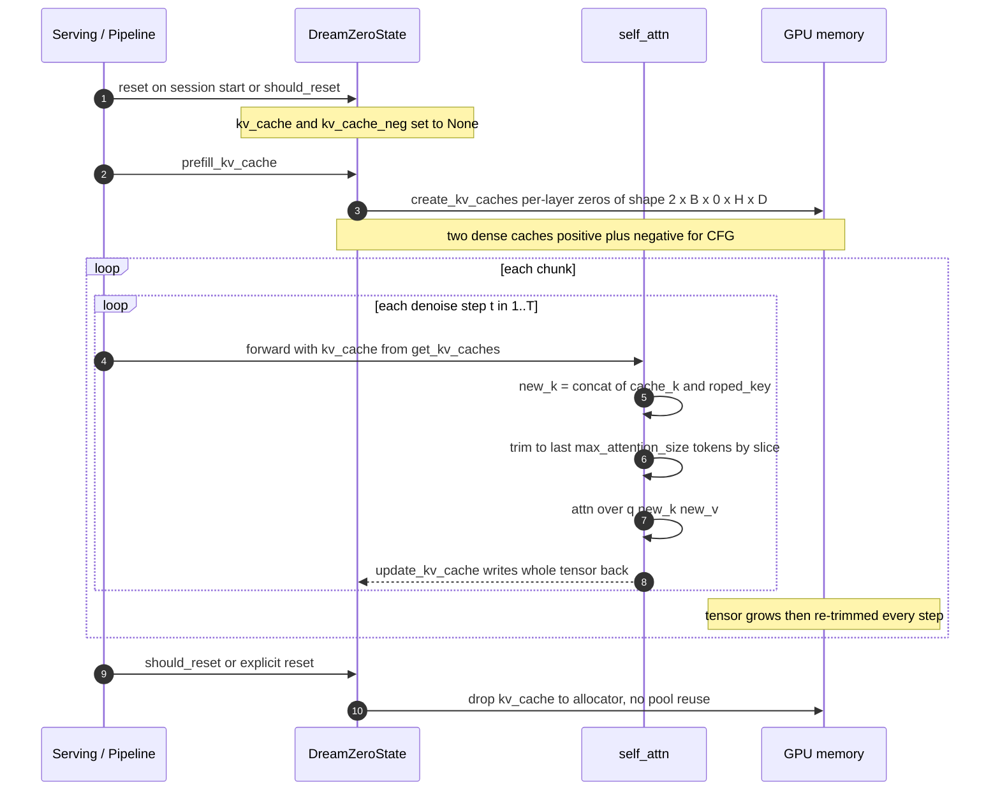
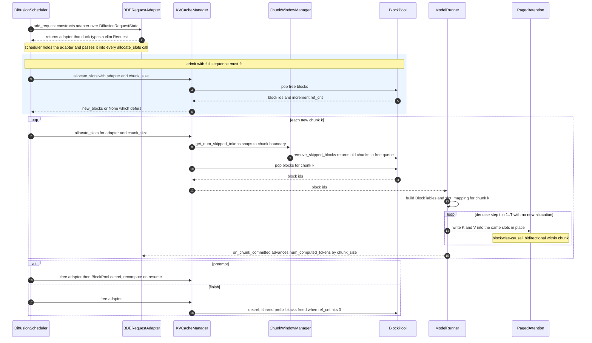

# [RFC] vLLM-Omni AR-Diffusion Engine 的统一 KV Cache 管理

!!! warning "提案 / 草案"
    这是一份设计提案（RFC）。它描述的是一个尚未作为统一组件存在的子系统。文中提到的按模型实现的 KV 复用路径（HunyuanImage3、SenseNova-U1、 Bagel、NextStep）今天都是真实存在但较为临时的实现；本 RFC 建议将它们收敛到 vLLM 主线的 KV cache 栈之上。

**范围。** 本 RFC 面向 **AR-Diffusion engine** —— Block Diffusion Engine（BDE），用于服务自回归、混合式、以及分块 blockwise-causal 的 diffusion 模型（world model、AR-DiT）。纯非 AR 的 DiT 模型（Flux、Qwen-Image、Wan 等）不产生持久 KV，**明确不在范围内**（见[非目标](#goals-and-non-goals)）。

- **状态：** 草案
- **反馈周期：** 至少 1 周
- **负责人：** Diffusion runtime
- **相关文档：**
  [Diffusion Step Execution](diffusion_step_execution.md),
  [Continuous Batching for Step-Wise Diffusion](diffusion_continuous_batching.md),
  [cache-dit](cache_dit.md), [TeaCache](teacache.md),
  [Automatic Prefix Caching in Omni Models](prefix_caching.md)
- **相关 RFC：**
  [World Model Support (#1987)](https://github.com/vllm-project/vllm-omni/issues/1987)、
  [Unified KV Cache Management for the AR-Diffusion Engine (#4366)](https://github.com/vllm-project/vllm-omni/issues/4366)
- **上游路线图：** #1987 在 *Future* 中列出了 “Page-attention and KV cache management for Autoregressive Diffusion”；本文是该条目的详细设计。
- **英文版 / 工作副本：** [BDE_doc](https://github.com/tzhouam/BDE_doc/blob/main/diffusion_kv_cache_management.md)

---

## 目录

- [动机](#motivation)
- [背景：今天已有的内容](#background-what-exists-today)
- [已有参考：FlashDreams](#prior-art-flashdreams)
- [核心决策](#core-decision)
- [目标与非目标](#goals-and-non-goals)
- [术语](#terminology)
- [设计方案](#proposed-design)
  - [架构概览](#architecture-overview)
  - [组件 1：BDERequestAdapter](#component-1-bderequestadapter)
  - [组件 2：ChunkWindowSpec / ChunkWindowManager](#component-2-chunkwindowspec--chunkwindowmanager)
  - [组件 3：Scheduler admission deltas](#component-3-scheduler-admission-deltas)
  - [组件 4：Runner BlockTables + slot_mapping](#component-4-runner-blocktables--slot_mapping)
  - [组件 5：Paged attention（blockwise-causal）](#component-5-paged-attention-blockwise-causal)
  - [配置入口](#configuration-surface)
  - [序列图：DreamZero 现状 vs BDE](#sequence-kv-management--dreamzero-today-vs-bde)
  - [请求生命周期集成](#request-lifecycle-integration)
  - [Chunk Window 驱逐语义](#chunk-window-eviction-semantics)
  - [T>1 Denoise 语义](#t1-denoise-semantics)
  - [多模态 segment 对齐（音视频）](#multimodal-segment-alignment-audio-visual)
- [现有模型迁移](#migration-of-existing-models)
- [分阶段上线](#phased-rollout)
- [工作拆解与跨工作流 Owner](#work-breakdown--cross-workstream-ownership)
- [考虑过的替代方案](#alternatives-considered)
- [风险与缓解措施](#risks-and-mitigations)
- [测试计划](#testing-plan)
- [开放问题](#open-questions)

---

<a id="motivation"></a>
## 动机

vLLM-Omni 的 diffusion 栈已经有成熟的 **feature/step cache** 层（`vllm_omni/diffusion/cache/`）：TeaCache、MagCache、cache-dit（DBCache / SCM / TaylorSeer），以及 prompt-embedding cache。这些组件的目标相同：通过跨 denoise step 复用 block residual 或 encoder output，**跳过冗余的 denoise 计算**。

当前缺失的是一层受管理的 **transformer Key/Value（KV）cache**，用于越来越多的 **自回归（AR）、混合式、以及分块 “world-model” diffusion 模型**。这些模型确实会物化 attention K/V tensor 并进行复用，但每个模型都以孤立方式实现，在 model module 上维护手写状态：

- **HunyuanImage3**（`models/hunyuan_image3/`）：基于 GPT 的 DiT。它会缓存 prompt / AR-prefix KV 一次（`image_kv_cache_map`、`image_kv_cache_lens`、`_injected_ar_kv`、`_cache_prompt_kv`），并在所有 denoise step 中复用。该模型的 TeaCache 被特殊处理，正是因为它“使用带 KV cache 的 GPT-based 架构，与标准 hook-based TeaCache 方法不兼容”（见 `cache/teacache/backend.py`）。
- **SenseNova-U1**（`models/sensenova_u1/`）：使用 HF `DynamicCache`，配合自定义 `prepare_flash_kv_cache()` / `clear_flash_kv_cache()` helper，并通过 `forward_und` / `forward_gen` 传递 `past_key_values`。
- **Bagel**、**NextStep-1.1**：token-AR understanding+generation 路径，也会传递 `past_key_values` / `use_cache`。
- **Chunked world-models**：由 [World Model RFC (#1987)](https://github.com/vllm-project/vllm-omni/issues/1987) 跟踪的自回归 chunk-diffusion 系列：**DreamZero**（P0 robotics world model）、Matrix Game、HunYuan World、Cosmos WFM、LingBot-World、Genie 3。每次 forward 生成一个 video/latent chunk，该 chunk 以 **blockwise-causal** 方式 attend 到过去 chunk，并且只保留一个有界的 past-chunk KV 窗口（VGGT-style sliding replace、DreamZero-style window reset）。这本质上就是 vLLM 的 sliding-window eviction 问题，只是粒度从 token 变成了 chunk。

### 现状问题

1. **没有内存记账。** KV tensor 按请求 eager 分配，并随序列长度增长。没有共享预算、没有类似 `gpu_memory_utilization` 的 sizing，也没有 back-pressure。长 prompt 或高并发会导致不可预测的 OOM。
2. **没有跨请求复用。** 两个请求若共享 conditioning prefix（system instruction、固定 reference image tokens、CFG 共享的 “negative prompt”），每次都会重复计算相同 KV。
3. **没有跨 step 契约。** “只计算一次 conditioning KV，并在 denoise step 之间复用” 这件事在每个模型里重复发明，且各自带着细微不同的不变量（`gen_timestep_scatter_index`、CFG batch layout、SP sharding）。
4. **没有 scheduler 集成。** diffusion scheduler（`sched/interface.py`）会跟踪请求生命周期（`WAITING` / `RUNNING` / `PREEMPTED` / `FINISHED_*`），但没有 KV residency 概念。被 preempt 的请求无法释放或恢复 KV；continuous batching 在接纳请求时也无法推理 KV 容量。
5. **没有 chunk-window eviction。** 只保留最近 `W` 个 chunk 的 world-model 目前都在手动 free/realloc。没有一个 allocator 理解“驱逐窗口之外的所有内容”，同时保护 attention sink。
6. **碎片化与分配抖动。** 手写 cache 通过 `torch.cat` + slice（DreamZero）或 per-request `torch.zeros` 增长，每步重写整张 tensor，频繁触发 CUDA allocator 的 alloc/free。高并发下 HBM 碎片化、可承载 batch 低于物理容量上限，并产生难以复现的 OOM。
7. **缺少 rollback / lookahead 原语（交互式流）。** 实时 world-model 会话（causal-WAN 风格）需要**中断**生成、**回滚**到上一个 chunk 边界（例如用户 steer rollout），或**推测性 lookahead**。Dense model-local tensor 只能破坏性截断；scheduler 无法驱动 chunk 级 release/restore 契约。
8. **分叉点处共享失效。** 即使两个分支共享 conditioning prefix（多参考图请求、CFG 正负分支），一旦 KV 在中途**分叉**，dense 布局必须整段拷贝 prefix。Copy-on-divergence 需要分页/分段存储 + per-block `ref_cnt` —— dense per-request tensor 无法表达。

### 新架构的预期收益

统一、与 vLLM 对齐的设计带来的收益，按痛点编号映射：

| # | 对应痛点 | BDE 分页 KV 的收益 | 主要场景 |
| --- | --- | --- | --- |
| B1 | (2), (8) | **Prefix 共享 + 廉价分叉**：共享 conditioning（系统指令、参考图 token、CFG 负分支）算一次，经 `ref_cnt` 共享；分叉后仅 post-divergence blocks 私有，无需拷贝 prefix | 云测：KV 显存 ≈ `(1−p)+p/S`；多参考图、CFG 负载 |
| B2 | (1), (6) | **减碎片、更大 batch**：预 sizing 的统一 `BlockPool` 替代 per-stream 最坏情况 dense 预留；admission control 替代 OOM | 高并发下每 GPU 吞吐 |
| B3 | (6) | **消除每步 alloc/free 抖动**：每 chunk 分配一次，T 步 denoise 原地写；无 `cat`+slice 整 tensor 重写 | 步延迟稳定性、长会话显存曲线 |
| B4 | (5), (7) | **Chunk 级生命周期成为 scheduler 契约**：动态 KV 增长、window 驱逐、**chunk 级 release/rollback/lookahead** 都变成 block-table 操作 | 实时交互：中断、steer、重生成 |
| B5 | (3), (4) | **一套契约替代 N 套实现**：HunyuanImage3 / SenseNova-U1 / Bagel / NextStep 迁移到统一路径；新 AR-DiT 模型免费获得 KV 管理 | 维护成本、接入速度 |
| B6 | — | **生态对齐**：复用 vLLM `KVCacheManager`/`BlockPool` 继承上游 prefix-cache、hybrid-allocator、KV-connector 改进；并为 **RL 训练环**留口子（`verl-omni : vllm-omni` 对应 `verl : vllm`） | RL post-training、上游特性继承 |

两条 framing 说明：

- **端测 vs 云测。** 单流交互（端测）主要获得 B3/B4；B1/B2 随并发和 prefix 共享放大，是**云测 batch serving** 收益，应在 batch 下评估。
- **B1 与 B2 是独立杠杆。** Prefix reuse 需要流量中有共享 conditioning；pooling/碎片化收益不需要 prefix 共享。分开汇报，避免“prefix 命中率低 ⇒ 没收益”的混淆。

<a id="background-what-exists-today"></a>
## 背景：今天已有的内容

| 层 | 模块 | 目的 | 管理 KV 内存？ |
| --- | --- | --- | --- |
| Feature/step cache | `cache/teacache`, `cache/magcache`, `cache/cache_dit_backend.py` | 通过 residual 复用跳过 denoise 计算 | 否 |
| Prompt-embed cache | `cache/prompt_embed_cache.py` | 在相同 prompt 间复用 `encode_prompt` 输出 | 否（CPU/host 对象） |
| Omni prefix caching | `docs/.../prefix_caching.md` | 基于 block hash 缓存 stage hidden-state / mm output（AR stages） | 类似 vLLM KV blocks，但缓存的是 **stage outputs**，不是 diffusion 内部 KV |
| 按模型 KV 复用 | `models/hunyuan_image3`, `models/sensenova_u1`, `models/bagel`, `models/nextstep_1_1` | 跨 denoise step 复用 conditioning/AR KV | **是，但临时且未统一管理** |

统一的 `CacheBackend` ABC（`cache/base.py`）只抽象 feature cache 的 `enable()` / `refresh()` / `is_enabled()`。它刻意**不**建模 KV 内存。本 RFC 增加一个互补子系统；它不会替换 feature-cache 层。

在 **vLLM 主线**一侧，V1 engine 已经有经过验证的 paged KV stack，我们希望复用它，而不是重新实现：

- `vllm/v1/core/kv_cache_manager.py`：`KVCacheManager.allocate_slots(request, num_new_tokens, ...)`、`free(request)`、`get_block_ids(request_id)`、`get_computed_blocks(request)`。这是唯一的 allocation 入口。
- `vllm/v1/core/block_pool.py`：`BlockPool` 持有全局 free queue、`ref_cnt`、prefix-cache index，以及 `null_block` placeholder。
- `vllm/v1/core/single_type_kv_cache_manager.py`：`SlidingWindowManager`，包含 `get_num_skipped_tokens()` / `remove_skipped_blocks()`，并通过按 `KVCacheSpec` 类型索引的 `spec_manager_map` 分发。
- `vllm/v1/kv_cache_interface.py`：`SlidingWindowSpec(block_size, num_kv_heads, head_size, dtype, sliding_window)` 以及 `get_kv_cache_spec_kind()`，它会把任何 `SlidingWindowSpec` 子类映射为 `KVCacheSpecKind.SLIDING_WINDOW`。
- `vllm/v1/worker/gpu/block_table.py`：`BlockTables`，将 block id 转换成 paged attention kernel 使用的 per-token `slot_mapping`。

<a id="prior-art-flashdreams"></a>
## 已有参考：FlashDreams

[NVIDIA FlashDreams](https://github.com/NVIDIA/flashdreams) 是面向交互式自回归视频和 world model 的高性能推理与 serving 框架。它是本 RFC 目标执行语义最接近的公开参考，尤其是它的 OmniDreams 集成和原生 `fp8_kvcache_cudnn` 路径。

FlashDreams 使用 per-session 自回归流水线：

```python
cache = pipeline.initialize_cache(...)
for autoregressive_index, control in enumerate(controls):
    chunk = pipeline.generate(autoregressive_index, cache, input=control)
    pipeline.finalize(autoregressive_index, cache)
```

`generate()` 与 `finalize()` 的拆分非常重要。`generate()` 是运行 denoise loop 并返回当前 video/latent chunk 的热路径。`finalize()` 则推进 AR/KV cache，以便下一个 chunk 使用；FlashDreams 明确指出这段 cache-update 工作可以移出热路径来隐藏延迟。这验证了本 RFC 中采用的 BDE 生命周期规则：**每个 chunk 分配一次，在该 chunk 的 denoise step 中复用/覆盖，并且只有在 chunk commit 时才推进 `num_computed_tokens`。**

FlashDreams 也为 chunk-window KV 提供了直接语义参考：`flashdreams.core.attention.kvcache.BlockKVCache` 以固定布局存储 KV：

```text
[ sink tokens | rolling local-window tokens ]
```

其行为与 BDE 的 `ChunkWindowSpec` 设计一致：

- `sink_size` 被保护，永不驱逐。
- `window_size` 是有界 rolling window。
- 每次 update 都精确写入一个 `chunk_size`。
- 对**同一个** `chunk_idx` 的重复 update 会覆盖相同物理位置（T>1 denoise 语义），而不是追加新的 KV。
- 当窗口已满时，local window 向左滚动，新 chunk 写入最右侧位置。

OmniDreams 的原生加速路径进一步强化了目标性能形态：其默认性能配置使用 `native_dit_backend = "fp8_kvcache_cudnn"` 和 cuDNN attention backend，cache geometry 来源于 `len_t`、`window_size_t` 和 `sink_size_t`。它的 WebRTC runtime 会保持 warm session，按 control interval 生成一个 chunk，并且只在新 session 开始时 reset rollout/cache。这是一个很强的参考信号：BDE 的实时 world-model KV 生命周期默认应当是 **session-scoped**，而不是 per-turn。

关键差异在于所有权。FlashDreams 在框架内部持有 cache tensor（每个 rollout/session 一个 `BlockKVCache`）。BDE **不应**把这种 allocator 设计照搬到 vLLM-Omni。相反，BDE 应复用 vLLM 的 `KVCacheManager`、`BlockPool`、prefix-cache refcount、admission gate，以及 worker `BlockTables`。因此，FlashDreams 是语义和生命周期参考，而 vLLM 仍然是内存管理权威。

### StreamDiffusionV2

[StreamDiffusionV2](https://github.com/chenfengxu714/StreamDiffusionV2) 是一个用于实时 video-to-video generation 的交互式 streaming diffusion 系统。它与 vLLM serving 的直接对齐程度不如 FlashDreams，但它为 BDE 提供了两个有用实现参考：用于 sliding-window causal video attention 的 **ring-buffer KV cache**，以及用于多 GPU streaming 的 distributed KV-owner rebalance 路径。后者**不是** BDE v1 的必需能力：vLLM 现有的静态 pipeline parallelism 已经会让每个 rank 保持本 rank layer-local KV，并在 rank 间传递 activation。只有当未来 world-model runtime 允许 KV block ownership 本身跨 rank 或跨节点变化时，rebalance 才会变得相关。

单 GPU 路径暴露了一个分阶段 loop：

```python
stream.prepare(prompt)
for video_chunk in stream.chunk_video(video):
    encoded = stream.encode_chunk(video, video_chunk, ...)
    denoised = stream.denoise_chunk(encoded)
    if denoised is not None:
        decoded_chunks.append(stream.decode_chunk(denoised))
```

在内部，causal Wan 模型会将每层 KV 存在 dense dictionary 中：

```python
kv_cache = {
    "k": ...,
    "v": ...,
    "global_end_index": ...,
    "local_end_index": ...,
    "total_steps": ...,
    "current_step": ...,
}
```

并维护一个 `evict_idx` 队列用于 ring-buffer slot 复用。当 local KV window 已满时，新的 chunk KV 会覆盖最旧的可复用 slot，而不是物理滚动整个 cache。这对 BDE 是一个重要区别：logical chunk window 可以前进，而物理存储可以通过 block-table / slot-mapping 更新来回收。换句话说，BDE 应将 window eviction 描述为 **vLLM block 上的逻辑可见性**，而不是要求进行 dense tensor roll。

StreamDiffusionV2 也显式保护 T>1 denoise。它的 cache 跟踪 `current_step` 与 `total_steps`；同一个 chunk 的重复 denoise pass 不会每次都 pop eviction queue。只有在该 chunk 的 denoise group 完成后，ring buffer 才会前进。这独立验证了 BDE 的规则：同一个 chunk 的重复 denoise step 覆盖相同 slot，并且 `num_computed_tokens` 只在 chunk commit 时推进。

还有两个有用想法，但不应进入 BDE v1 主路径：

- **Adaptive sink refresh。** StreamDiffusionV2 可选地比较新 K/V 与 sink K/V 的平均余弦相似度（`adapt_sink_threshold`），并刷新低相似度的 sink 位置。这对 long-running session 很有前景，但会让 vLLM prefix sharing 和 refcount 更复杂，因此 BDE v1 应保持 fixed sink，并把 adaptive sink 列为未来工作。
- **Dynamic KV-owner rebalance。** 其分布式 `KVCacheManager.compute_block_owners()` / `rebalance_kv_cache_by_diff()` / `broadcast_kv_blocks()` 路径会跟踪跨 rank 的 block interval ownership，并从旧 owner 向新 owner 广播移动的 KV block。它不应与普通 vLLM PP 混淆：在普通 vLLM PP 中，layer ownership 是静态的，历史 KV 会留在拥有该 layer 的 rank 上。对 BDE 来说，这只是在未来支持 dynamic rank ownership 或 cross-node KV movement 时的 prior art；默认路径应依赖 vLLM 的 PP/KV-connector 抽象，而不是复制这套机制。

与 FlashDreams 类似，StreamDiffusionV2 应被视为 **语义和系统模式参考**，而不是要复制其 allocator。BDE 仍将 allocation、admission、prefix refcounting 和 worker block table 委托给 vLLM。

### AR-DiT 生态调研

除 FlashDreams 和 StreamDiffusionV2 外，围绕 AR-DiT / causal video diffusion inference 已经出现了一个小而快速发展的开源生态。这些项目验证了 BDE 目标工作负载的核心形态，但多数仍以模型本地 dense tensor 或方法专有 cache state 来管理 KV。BDE 的贡献是把相同语义带入 vLLM 共享的 KV allocator、scheduler 和 paged-attention 栈。

| 项目 | 贡献 | 与 BDE 的相关性 |
| --- | --- | --- |
| [CausVid](https://github.com/tianweiy/CausVid) | 通过 DMD-style distillation 将 bidirectional video DiT 转换为 causal / autoregressive generator；提供带 KV caching 的 autoregressive 和 long-video inference 脚本。 | 基线 AR-DiT 推理语义：causal rollout、few-step denoise、long-video sliding-window inference。 |
| [Self-Forcing](https://self-forcing.github.io/) | 通过带 KV caching 的模拟 inference rollout 训练 AR video diffusion，降低 train-test exposure bias。 | 支持 BDE 的 chunk-commit 规则：cache state 应根据生成出的 context 前进，而不是根据 teacher-forced future tokens 前进。 |
| [Causal-Forcing](https://github.com/thu-ml/Causal-Forcing) | CausVid / Self-Forcing 的后续工作，包含用于实时交互式视频生成的 chunk-wise 和 frame-wise 模型。 | 有助于模型接口覆盖：BDE 不应假设只有 chunk-wise AR；frame-wise AR 也是有效 adapter 目标。 |
| [Rolling Forcing](https://github.com/TencentARC/RollingForcing) | 使用 rolling-window denoising 和 attention sink 的 long-video AR diffusion，用于多分钟 streaming generation。 | fixed sink + rolling window 语义和 long-running session 行为的强参考。 |
| [FastVideo](https://github.com/hao-ai-lab/FastVideo) | 统一的视频 diffusion inference / post-training 框架；包含带 KV 与 cross-attention cache state 的 causal Wan stages。 | 如何将 causal AR inference 集成进通用 video-serving pipeline，而不是一次性脚本的参考。 |
| [MAGI-1](https://github.com/SandAI-org/MAGI-1) | 大规模开源 AR video model，生成固定大小 chunk（24 帧），具备可扩展 attention 基础设施。 | 高吞吐 chunk pipeline 和分布式 / long-context attention 的未来参考，不是 v1 allocator 模型。 |
| [Forcing-KV](https://github.com/zju-jiyicheng/Forcing-KV) | 面向 Self-Forcing、LongLive、Causal Forcing、Rolling Forcing 等的 inference-side hybrid KV cache compression 工具包。 | 在 BDE 基础 BlockPool 集成稳定后，可作为 KV compression / memory reduction policy 的未来工作。 |

设计含义：该生态在 **causal / chunked rollout with KV caching** 上收敛，但没有在共同 allocator 上收敛。这强化了 RFC 的核心决策：vLLM-Omni 不应再添加一个 model-local KV cache，而应将这些 AR-DiT 模式规范化到 vLLM 的 `KVCacheManager`、`BlockPool`、`BlockTables` 和 scheduler admission path 上。

<a id="core-decision"></a>
## 核心决策

> **复用 vLLM 主线 KV 管理；在 diffusion engine 中构建缺失的兼容层。不要构建并行的 diffusion-local allocator。**

具体来说，diffusion engine 采用 vLLM 的 `KVCacheManager` / `BlockPool` / `BlockTables` / paged-attention 路径，我们只补齐 diffusion runtime 今天缺失的 glue：

```text
Primary plan:
  Extend the diffusion step engine so it can drive vLLM's
  KVCacheManager.allocate_slots() and BlockTables, instead of hand-rolling KV.

New compatibility layers (the deliverables of this RFC):
  1. BDERequestAdapter        — make a diffusion request look like vllm Request
  2. ChunkWindowSpec          — a SlidingWindowSpec variant (chunk granularity)
     ChunkWindowManager       — extends SlidingWindowManager, registered in
                                spec_manager_map
  3. Scheduler admission deltas — give the diffusion scheduler token-like
                                  num_new_tokens / num_computed_tokens so it can
                                  gate on KV capacity
  4. Runner BlockTables + slot_mapping integration
  5. Paged attention backend, blockwise-causal (causal=False over present blocks)
```

此前提出的 `DiffusionKVCacheManager`（新的 diffusion-local block pool + prefix index + profiler + eviction policy）被**拒绝**，并移至[替代方案](#alternatives-considered)：它会 fork 出第二套 allocator、refcount 模型、prefix index 和 eviction policy，而我们之后必须永远让它与 vLLM 保持同步。

**库级复用，而非框架级复用。** 审阅意见
（[BDE_doc #1](https://github.com/tzhouam/BDE_doc/issues/1)）指出：diffusion scheduler/runner **不应**被“嵌入”vLLM 框架；它们保持独立，只是**调用** `KVCacheManager` 作为**库**，通过 `BDERequestAdapter` 传入 duck-typed request view。这与“把 diffusion 变成 vLLM LLM engine 的一个 mode”不同——后者会强迫 scheduler/runner 继承 vLLM 的 token-decode 假设。当前设计已经是库级复用；更轻量的“只导入 block table + kernels、跳过 manager”方案见[替代方案 7](#alternatives-considered)。

<a id="goals-and-non-goals"></a>
## 目标与非目标

### 目标

- **复用**而不是重新实现 vLLM 的 `KVCacheManager`、`BlockPool`、`SlidingWindowManager`、`BlockTables` 和 paged attention kernels。
- 一个 `BDERequestAdapter`，满足 `vllm.v1.request.Request` 中 `KVCacheManager` 实际会触碰的子集契约（见[组件 1](#component-1-bderequestadapter)）。
- 一个 `ChunkWindowSpec`（`SlidingWindowSpec` 的子类）+ `ChunkWindowManager`（`SlidingWindowManager` 的子类），用于 **chunk-granularity** window eviction，并注册到 vLLM 的 `spec_manager_map`。
- diffusion scheduler 的 **admission deltas**，使 continuous batching 可以基于 KV capacity 做 admission gate，并在 preempt/finish 时 free/restore。
- Runner 侧 `BlockTables` + `slot_mapping` 接线，让 attention 读写 paged KV pool。
- 一条迁移路径，让 HunyuanImage3 / SenseNova-U1 / Bagel / NextStep 在不改变行为的情况下删除各自定制 cache。

### 非目标

- 不修改或替换 feature/step caches（TeaCache、MagCache、cache-dit）。它们保持正交且可组合。
- 不构建新的 diffusion-local KV allocator / block pool / prefix index。我们复用 vLLM 的实现（这是相对早期草案的明确反转）。
- 不为没有 KV 的纯 DiT 模型（Flux、Qwen-Image、Wan、Z-Image 等）启用 manager。对于这些模型，adapter 根本不会被构造。
- v1 不解决 multi-node KV transfer（留给后续阶段，可以复用现有 Omni connector layer + vLLM 的 KV connector hooks）。

<a id="terminology"></a>
## 术语

- **AR-Diffusion engine / BDE（Block Diffusion Engine）**：vLLM-Omni 面向**自回归** diffusion 的执行引擎——按 chunk 生成、采用 blockwise-causal attention 并维护持久 KV 的模型（world model、AR-DiT、混合 AR+DiT）。本文 RFC 的主题；后文 “BDE” 均指该引擎。
- **DiT**：Diffusion Transformer（denoiser 会在 latent 上运行 N 次）。
- **AR/hybrid model**：denoiser 是 causal/GPT-style transformer，并维护 attention KV 的模型（例如 HunyuanImage3）。
- **Chunk**：world-model 中用于 KV 记账的自回归生成单元：模型每前进一个 causal attention block 时物化的一组持久 self-attention tokens。每个 chunk 有 `chunk_size` 个 token。对 DreamZero 来说，它对应 `num_frame_per_block * frame_seqlen`，而不是一次 OpenPI serving request，也不是外层 4 帧观测聚合（`FRAMES_PER_CHUNK`）。first-frame prefill 是一个特殊 prefix，长度为 `frame_seqlen`；action/state registers 只是 per-forward tokens，会参与 attention，但不属于持久 self-attention KV。
- **Chunk window**：保留 KV resident 的最近 `W` 个 chunk（`sliding_window = W * chunk_size`）。
- **Blockwise-causal attention**（#1987 术语）：一个 chunk 会 causal 地 attend 到所有过去 chunk，并在自身内部双向 attend。我们通过 block-table membership 实现跨 chunk causality，并通过 `causal=False` 实现 chunk 内部双向性（见[组件 5](#component-5-paged-attention-blockwise-causal)）。
- **Conditioning KV**：请求中所有 denoise step 都保持常量的 token 对应的 K/V（text prompt、reference-image tokens、AR prefix）。这是优先复用目标。
- **Denoise step**：对 noisy latent 做一次 transformer forward；`ForwardContext.denoise_step_idx` 已经跟踪它。
- **CFG branch**：设置 `do_classifier_free_guidance` 时，batch row 中的 positive（conditional）与 negative（unconditional）分支。

<a id="proposed-design"></a>
## 设计方案

<a id="architecture-overview"></a>
### 架构概览

```
                    OmniDiffusionConfig.kv_cache_config
                                  │
        ┌─────────────────────────┼──────────────────────────┐
        │                         │                           │
  DiffusionScheduler        DiffusionWorker            DiffusionModelRunner
  (sched/*.py)              (worker/diffusion_worker)  (worker/diffusion_model_runner)
        │                         │                           │
        │ admission deltas        │ owns                      │ per-step:
        │ (num_new_tokens,        │                           │  build BlockTables
        │  num_computed_tokens)   ▼                           ▼  + slot_mapping
        │            ┌──────────────────────────────────────────────┐
        │            │   BDERequestAdapter (looks like vllm Request)  │
        └──────────▶ └──────────────────────────────────────────────┘
                                  │  passed to
                                  ▼
                ┌─────────────────────────────────────────────────────┐
                │     vLLM mainline KV stack (REUSED, not forked)       │
                │  KVCacheManager.allocate_slots() / free()             │
                │  BlockPool (free queue, ref_cnt, null_block)          │
                │  ChunkWindowManager  ⊂ SlidingWindowManager           │
                │     keyed by ChunkWindowSpec ⊂ SlidingWindowSpec      │
                └─────────────────────────────────────────────────────┘
                                  │ block ids
                                  ▼
                          BlockTables → slot_mapping
                                  │
                                  ▼
          paged attention (blockwise-causal: causal=False over present blocks)
```

虚线框 “vLLM mainline KV stack” 内的所有内容都被**导入并复用**。框外四块（`BDERequestAdapter`、`ChunkWindowSpec`/`ChunkWindowManager` 注册、scheduler deltas、runner `BlockTables`/`slot_mapping`）是本 RFC 引入的新代码。

<a id="component-1-bderequestadapter"></a>
### 组件 1：BDERequestAdapter

`KVCacheManager.allocate_slots(request, ...)` 和 `get_computed_blocks(request)` 操作的是 `vllm.v1.request.Request`。diffusion engine 中则是 `DiffusionRequestState`（`sched/interface.py`）包装 `OmniDiffusionRequest`，后者**没有** `num_computed_tokens`、`num_tokens` 或 `block_hashes`。adapter 只桥接 KV manager 会读取的属性，不做更多事情。

通过阅读 `allocate_slots` / `get_computed_blocks`，被触碰的 surface 是：

| 属性 / 方法 | 用途 | Diffusion 含义 |
| --- | --- | --- |
| `request_id` | block ownership keying | `DiffusionRequestState.request_id` |
| `num_computed_tokens` | computed-prefix length | 已物化的 chunk token（`completed_chunks * chunk_size`） |
| `num_tokens` | cache-commit cap、full-fit gate | 当前 chunk 落地后的总 token 数 |
| `block_hashes` | prefix-cache lookup | conditioning-prefix hash blocks；禁用 cache 时为空 |
| `skip_reading_prefix_cache` | bypass prefix lookup | prefix reuse 启用前（Phase 3）为 `True` |
| `num_preemptions` | 仅用于 stats | 来自 scheduler preempt counter |

```python
# vllm_omni/diffusion/kv_cache/adapter.py  (proposed)

class BDERequestAdapter:
    """Adapts a diffusion request to the subset of vllm Request that
    KVCacheManager.allocate_slots()/get_computed_blocks() actually reads.

    NOT a full Request: it only implements the attributes exercised by the
    KV manager. A conformance test asserts the touched attribute set does not
    drift (see Testing Plan)."""

    def __init__(self, state: DiffusionRequestState, *, chunk_size: int):
        self._state = state
        self._chunk_size = chunk_size
        self._completed_chunks = 0
        self._block_hashes: list = []          # filled only when prefix reuse on

    @property
    def request_id(self) -> str:
        return self._state.request_id

    @property
    def num_computed_tokens(self) -> int:
        return self._completed_chunks * self._chunk_size

    @property
    def num_tokens(self) -> int:
        # tokens once the in-flight chunk is committed
        return (self._completed_chunks + 1) * self._chunk_size

    @property
    def block_hashes(self):
        return self._block_hashes

    @property
    def skip_reading_prefix_cache(self) -> bool:
        return True                            # Phase 3 flips this on

    @property
    def num_preemptions(self) -> int:
        return 0

    def on_chunk_committed(self) -> None:
        self._completed_chunks += 1
```

adapter **不会**注册成 vLLM `Request`；它是结构化 duck-type。为了保证这一点可靠，会有一个单元测试通过 recording proxy 反射 `allocate_slots` / `get_computed_blocks` 引用了哪些 `Request` 属性，并在 adapter 缺少属性时失败。

<a id="component-2-chunkwindowspec--chunkwindowmanager"></a>
### 组件 2：ChunkWindowSpec / ChunkWindowManager

World-model 只保留最近 `W` 个 chunk 的 KV。这是一个以 chunk 为单位的 sliding window，因此我们把它表达为 `SlidingWindowSpec`，其中 `sliding_window = W * chunk_size`，并继承 manager，使 eviction 对齐到 chunk 边界。

```python
# vllm_omni/diffusion/kv_cache/chunk_window.py  (proposed)

from vllm.v1.kv_cache_interface import SlidingWindowSpec
from vllm.v1.core.single_type_kv_cache_manager import (
    SlidingWindowManager, spec_manager_map,
)

@dataclass(frozen=True, kw_only=True)
class ChunkWindowSpec(SlidingWindowSpec):
    # sliding_window (inherited) MUST equal window_chunks * chunk_size.
    chunk_size: int
    window_chunks: int
    sink_chunks: int = 0          # protected leading chunks (attention sink)
    reset_at_boundary: bool = False   # True => DreamZero window-reset semantics

    def __post_init__(self):
        super().__post_init__()
        assert self.sliding_window == self.window_chunks * self.chunk_size


class ChunkWindowManager(SlidingWindowManager):
    """Chunk-granularity eviction on top of SlidingWindowManager.

    Reuses BlockPool's free queue, ref_cnt, and null_block replacement. Only the
    'which tokens are skipped' math is overridden so eviction snaps to chunk
    boundaries and honors sink_chunks."""

    def get_num_skipped_tokens(self, num_computed_tokens: int) -> int:
        spec: ChunkWindowSpec = self.kv_cache_spec
        sink = spec.sink_chunks * spec.chunk_size
        if spec.reset_at_boundary:
            # Window reset: at each chunk boundary everything past sink is dropped.
            completed = (num_computed_tokens // spec.chunk_size) * spec.chunk_size
            return max(0, completed - sink)
        # Sliding replace: keep last `window_chunks` chunks (+ sink).
        # Base SlidingWindowManager uses `- sliding_window + 1` to keep the
        # in-flight token's window intact. Because chunks are block-aligned and
        # we snap the skip count down to a chunk boundary, that ±1 is absorbed:
        # we never skip into a chunk that the current window still needs.
        keep = spec.sliding_window
        skipped = max(0, num_computed_tokens - keep - sink)
        # snap down to a chunk boundary so we never half-evict a chunk
        return (skipped // spec.chunk_size) * spec.chunk_size


# Register so KVCacheManager dispatches ChunkWindowSpec to ChunkWindowManager.
# Dispatch is by EXACT type (`spec_manager_map[type(kv_cache_spec)]`), so the
# subclass must be registered explicitly — inheritance alone is not enough.
spec_manager_map[ChunkWindowSpec] = ChunkWindowManager
```

为什么它可以干净接入：

- `get_kv_cache_spec_kind()` 已经会把**任何** `SlidingWindowSpec` 子类映射到 `KVCacheSpecKind.SLIDING_WINDOW`（`isinstance(spec, SlidingWindowSpec)` 分支），并且 `SlidingWindowManager` 的 cache-hit 路径 assert 的也是 `SlidingWindowSpec`，继承即可满足二者。
- `remove_skipped_blocks()`（由 `allocate_slots` 调用的 eviction driver）直接继承；我们只覆盖 token-skip 计算。因此 eviction 仍通过 `BlockPool` 的单一 free queue 和 `null_block` replacement 完成，没有并行的 `_expired_pool`。
- `max_admission_blocks_per_request()` 继承自 `SlidingWindowSpec`，会把 pool sizing/admission 限制到 window size，这正是 world-model 不变量。

**Sink protection：** sinks 被跟踪为开头的 `sink_chunks` blocks，并在上面的 skip count 中排除，因此只要请求存活，`BlockPool` 就不会回收它们。（早期草案跟踪相对 index；跟踪开头 chunk count 等价，并可避免 `null_block` index drift。）

<a id="component-3-scheduler-admission-deltas"></a>
### 组件 3：Scheduler admission deltas

`KVCacheManager.allocate_slots(request, num_new_tokens, ...)` 需要一个**类 token 的 delta**。diffusion scheduler 目前只输出 request id（`DiffusionSchedulerOutput.scheduled_request_ids`），没有 per-request token count。我们添加最小记账：

- `num_new_tokens` 表示“本次 admission 会物化多少个持久 KV token”，不是“decode 了多少文本 token”。对 chunked world-model 来说，常规值是 `chunk_size`。
- DreamZero 的具体映射：对一个常规 causal attention block，`num_new_tokens = chunk_size = num_frame_per_block * frame_seqlen`。first-frame prefill 是特殊 prefix，`num_new_tokens = frame_seqlen`。action/state registers 是 per-forward tokens，不计入 `num_new_tokens`，因为它们不会 append 到持久 self-attention KV。
- 在 admit / 每个新 chunk 时，adapter 的 `num_computed_tokens` 表示已经 commit 的持久 KV（`completed_chunks * chunk_size`，再加模型特定的 prefill prefix）。scheduler 在 request 进入 running batch 前调用 `allocate_slots(adapter, num_new_tokens=..., full_sequence_must_fit=...)`。返回 `None` 表示“没有足够 free block” → defer/preempt，行为与 vLLM scheduler 一致。
- 对 `T > 1` denoise，每个 chunk 只有第一个 step 分配 slot。step `1..T-1` 使用 `num_new_tokens = 0` 并复用同一份 `slot_mapping`；adapter 只在 chunk commit 时推进一次 `num_computed_tokens`。
- 这只是 bookkeeping；它不改变 diffusion 固定 step count 的执行模型。它把 KV capacity 失败前移到 scheduler admission 阶段，而不是等到 model forward 内部才 OOM。

<a id="component-4-runner-blocktables--slot_mapping"></a>
### 组件 4：Runner BlockTables + slot_mapping

`allocate_slots` 返回 block 之后，runner 必须把它们转换成 attention kernel 读写所需的 per-token `slot_mapping`。我们复用 `vllm/v1/worker/gpu/block_table.py`：

```python
# in DiffusionModelRunner, per scheduled chunk
blocks = kv_cache_manager.allocate_slots(adapter, num_new_tokens=chunk_size)
if blocks is None:
    # back-pressure: scheduler defers this request
    ...
block_ids = kv_cache_manager.get_block_ids(adapter.request_id)
bde_block_tables.append_block_ids(req_index, block_ids)     # worker-side view
slot_mapping = bde_block_tables.compute_slot_mapping(positions)
# slot_mapping + the paged kv_cache tensor go into ForwardContext / attn metadata
```

**已知缺口（明确指出，而不是含糊带过）：** worker `BlockTables` 视图不会自动观察到 scheduler 侧 eviction 产生的 `null_block` replacement。runner 必须在每个 chunk 重新拉取 `get_block_ids()`（或应用相同 skip）并重建 `slot_mapping`，否则会读到已驱逐 block。这是 Phase 2 的具体工作项，不是一个假设。

<a id="component-5-paged-attention-blockwise-causal"></a>
### 组件 5：Paged attention（blockwise-causal）

[World Model RFC (#1987)](https://github.com/vllm-project/vllm-omni/issues/1987) 将 autoregressive chunk diffusion 的 attention 定义为 **blockwise causal**：每次 forward 产生一个 chunk，它 attend 到**所有过去 chunk**（跨 chunk causal），同时在**当前 chunk 内部双向**（chunk 自身 token 之间 full attention）。这正是我们必须支持的 mask 形态，并且能自然映射到 vLLM 的 paged 路径：

- **跨 chunk（causal）：** 由结构保证，而不是 token mask。一个 chunk 的 block table 只包含过去 chunk + 当前 chunk（未来 chunk 尚未生成），`ChunkWindowManager` 还会进一步裁剪到 resident window。kernel 永远看不到 future-chunk KV，因此跨 chunk causality 是“免费的”。
- **chunk 内部（bidirectional）：** 当前 chunk 的 query token 必须彼此完全可见，因此对**当前存在** block 的 per-forward mask 必须是**非 causal**（`causal=False`）。设置 `causal=True` 会错误地在 chunk 内施加 triangular mask。

所以，“blockwise causal” 可以分解为：“对 table 中存在的 blocks 使用 `causal=False`”。这就是为什么 block manager（组件 2 与 4）承担主要工作，而 kernel 以 `causal=False` 运行。

当前 diffusion `AttentionImpl.forward(query, key, value, attn_metadata)` 签名（`attention/backends/abstract.py`）直接接收 K/V tensor，今天**没有** `kv_cache` / `block_table` 参数。因此“复用 paged attention”不是免费的，它需要一个 backend：

1. 接收 paged `kv_cache` tensor + `block_table` + `slot_mapping`（通过 `AttentionMetadata.extra` 传入，或新增 typed field），并且
2. 以 `causal=False` 运行（`AttentionImpl.__init__` 已暴露 `causal: bool = False`）。

因此，v1 集成会添加一个**paged diffusion attention backend**（包装 vLLM 的 paged kernel），在设置 `kv_cache_config.enable` 时选择。现有 dense backends 仍作为 pure-DiT / cache-off 路径的默认值。

> KV **管理**（谁持有 block，何时驱逐）完全委托给 vLLM。Attention **语义**（blockwise-causal：通过 block-table membership 实现跨 chunk causality、通过 chunk 内 `causal=False` 实现双向性、null-hole 处理、position ids）是另一个由 backend 负责的问题，**不是** block manager 解决的。

<a id="configuration-surface"></a>
### 配置入口

扩展已经包含 `cache_backend` / `cache_config` 的 `OmniDiffusionConfig`（`diffusion/data.py`）：

```python
@dataclass
class OmniDiffusionConfig:
    ...
    cache_backend: str = "none"                       # feature/step cache (existing)
    cache_config: DiffusionCacheConfig | dict = field(default_factory=dict)
    # NEW: transformer KV cache management (reuses vLLM stack)
    kv_cache_config: DiffusionKVCacheConfig | dict = field(default_factory=dict)

@dataclass
class DiffusionKVCacheConfig:
    enable: bool = False
    chunk_size: int = 0               # tokens per AR chunk (0 => single prefill)
    window_chunks: int | None = None  # None => full attention (no eviction)
    sink_chunks: int = 0
    reset_at_boundary: bool = False
    gpu_memory_fraction: float = 0.1
    enable_prefix_reuse: bool = False # cross-request conditioning reuse (Phase 3)
```

当 `enable=False`（默认）时，行为与当前路径**逐字节一致**，模型在迁移前继续保留现有代码。RFC 一开始是严格 additive 的。

<a id="sequence-kv-management--dreamzero-today-vs-bde"></a>
### 序列图：DreamZero 现状 vs BDE

下面两张序列图对比 KV cache 在 **当前 DreamZero model-local 路径**与**复用 vLLM 分页 KV 栈的 BDE 路径**中如何分配、更新、窗口化与释放。它们基于真实代码：`vllm_omni/diffusion/models/dreamzero/state_dreamzero.py`（`create_kv_caches` / `update_kv_cache` / `reset`）和 `causal_wan_model.py`（`self_attn` 滚动 `cat` + `[-max_attention_size:]` slice）代表“现状”，`KVCacheManager` / `BlockPool` / `ChunkWindowManager` 代表“提案”。

#### 现状 — DreamZero model-local dense rolling KV

KV **存在于 model state 对象内部**，每层一个 dense 连续 tensor，通过 `torch.cat` 增长、每 denoise step 用 slice 裁剪。窗口由 slice 强制；没有 pool、没有 paging、没有跨请求共享。CFG 保留**第二份**完整拷贝（`kv_cache_neg`）。



可见痛点：每步 `cat`+slice 重写整层 tensor（分配抖动）；窗口是 model-private 约定而非 scheduler 契约；CFG 双倍内存；释放后内存回到 allocator 而非可复用 block pool——因此无法跨请求 prefix 共享。

#### 提案 — BDE over vLLM paged KV

KV block 来自**共享 `BlockPool`**；diffusion request 通过 `BDERequestAdapter` 呈现给未修改的 `KVCacheManager`。窗口化是 scheduler 级契约，由 `ChunkWindowManager` 在 chunk 边界驱逐；`T>1` denoise **原地**复用同一 slot。



#### 序列图逐步解读：BDE KV 生命周期

以下步骤编号与渲染后的 `autonumber` 序列图一致。

**阶段 1 — 请求入口（步骤 1–2）。**

1. **`add_request` 构造 adapter：** scheduler 为新请求构造 `BDERequestAdapter`，初始 `num_computed_tokens = 0`。它是结构化 duck-type，不是真实 vLLM `Request`；只实现 KV manager 读取的字段。
2. **Adapter 返回 decorated request view：** scheduler 持有同一对象，并在后续每次 `allocate_slots()` / `free()` 中传入。Adapter 是 diffusion state 与 vLLM KV manager 之间的 request-lifetime 桥梁。

**阶段 2 — Admission gate（蓝色 `rect`，步骤 3–6）。**

对应 `full_sequence_must_fit=True`：只有 KV cache 在 prefix hit 和 window eviction 之后仍能容纳所需序列时才接纳；否则 defer，而非强行 admission 导致 preempt/OOM。

3. **`allocate_slots` with adapter and `chunk_size`：** scheduler 用 adapter 作为 vLLM 兼容 request view 请求 slot。
4. **`pop free blocks`：** `KVCacheManager` 向 `BlockPool` 索取空闲物理 block。
5. **`block ids and increment ref_cnt`：** 返回 block id 并递增引用计数；`ref_cnt` 使 prefix/CFG 共享与安全释放成为可能。
6. **`new_blocks or None which defers`：** 返回 allocated blocks，或 `None`（scheduler defer）。

**阶段 3 — 逐 chunk 生成（`loop each new chunk k`，步骤 7–15）。**

核心循环：先释放窗口外 block，再为当前 chunk 分配，再在相同 slot 上运行 `T` 个 denoise step。

7. **`allocate_slots` for chunk `k`。**
8. **`get_num_skipped_tokens` 对齐 chunk 边界：** 计算窗口外 token/chunk 数，snap 到 chunk 边界，避免半驱逐。
9. **`remove_skipped_blocks` 归还 free queue：** 窗口外 block 在**新分配之前**归还 `BlockPool`，同一步可立即复用。
10. **`pop blocks for chunk k`：** 通过 `BlockPool` 分配；`ChunkWindowManager` 决定可释放哪些 block，但不直接分配下一 chunk。
11–12. **`block ids` 转发至 ModelRunner。**
13. **`build BlockTables and slot_mapping`：** 将 logical chunk 位置映射到物理 block id。

**内层 denoise loop（步骤 14）。**

14. **原地写入 K/V：** 每个 chunk 经 `T` 步 denoise，每步写入同一 slot；不追加 block、不再次 `allocate_slots()`。黄色注释 **blockwise-causal, bidirectional within chunk** 表示跨 chunk causality 由 block table 结构表达，chunk 内 attention 双向（`causal=False`）。

15. **`on_chunk_committed` 增加 `num_computed_tokens`：** 仅在该 chunk 全部 `T` 步完成后 advance；每 chunk 一次，而非每 denoise step 一次——这是 T>1 原地复用的关键不变量。

**阶段 4 — Preempt 或 finish（`alt`，步骤 16–18）。**

16. **Preempt：** `free adapter`，`BlockPool` decref；resume 时重新计算 KV。
17. **Finish：** 正常完成时 scheduler 释放 request。
18. **共享 prefix 释放：** `ref_cnt` 归零时才物理释放共享 prefix block。

与 DreamZero 现状的核心对比：分配、window eviction、T>1 原地更新、释放都通过 vLLM 分页 KV ownership 表达，而非 model state 内的 private dense tensor。

语义对比：

| 方面 | DreamZero 现状 | BDE（提案） |
| --- | --- | --- |
| 存储 | model state 内 dense per-layer tensor | 共享 `BlockPool` 的分页 block |
| 分配 | `torch.zeros(…,0,…)` + `cat` 增长 | `KVCacheManager.allocate_slots()` |
| 窗口 | 每步 `[-max_attention_size:]` slice | `ChunkWindowManager` chunk 边界驱逐 |
| 更新（`T>1`） | 每步重写整 tensor | 同一 `slot_mapping` 原地写 |
| CFG | 第二份完整 cache（`kv_cache_neg`） | 独立 request/blocks；可 pool、可共享 |
| 释放 | drop tensor → allocator | `free()` → block 回 pool（`ref_cnt`） |
| 跨请求复用 | 无 | prefix index + `ref_cnt`（Phase 3） |

<a id="request-lifecycle-integration"></a>
### 请求生命周期集成

| Scheduler event | Action（全部通过复用的 vLLM manager） |
| --- | --- |
| `add_request` | 构造 `BDERequestAdapter`；（Phase 3）计算 conditioning `block_hashes` |
| `schedule`（admit） | `allocate_slots(adapter, chunk_size, full_sequence_must_fit=True)`；`None` ⇒ defer |
| 每个新 chunk | `allocate_slots(adapter, chunk_size)`；重建 `BlockTables`/`slot_mapping`；`adapter.on_chunk_committed()` |
| 每个 denoise step（同一 chunk） | 原地复用该 chunk 的 slot（见 [T>1](#t1-denoise-semantics)）；不做新分配 |
| `preempt_request` | `kv_cache_manager.free(adapter)`（drop）；resume 时重新计算 |
| `finish_requests` | `kv_cache_manager.free(adapter)`；`BlockPool` decref 共享 prefix blocks |

因为 diffusion 每个 chunk 的 step 数是**固定且已知**的，并且 conditioning KV 对 step 不变，所以常见情况是：每个 chunk 分配，旧 chunk 由 `ChunkWindowManager` 驱逐，并且永不无界增长。

#### Prefix-cache 生命周期：admission 时匹配一次

<a id="prefix-cache-lifecycle-match-once-at-admission"></a>
审阅讨论后澄清（[BDE_doc #1](https://github.com/tzhouam/BDE_doc/issues/1)）；匹配纪律与 vLLM LLM serving 一致：

- **匹配只发生一次，在 waiting 状态。** `get_computed_blocks(adapter)` 在 admission 前探测 prefix index，请求进入 `RUNNING` 之前完成。Running 请求**不再**重新探测：chunk 与 denoise step 复用已解析的 `num_computed_tokens`、block id、`BlockTables` 和 `slot_mapping`。BDE_doc #1 中的 reviewer 测量表明，在合理 `block_size` 下，这种一次性匹配成本相对请求总 runtime 可忽略。
- **DiT 风格模型（HunyuanImage3）：** request 级生命周期与 vLLM LLM serving 相同——admission 时 match，所有 denoise step 复用，`finish` 时 `free()`。唯一扩展是 **image/conditioning token 可 hash 且可 cache**（见 `prefix_key_design.md`）。
- **流式模型（CausalWAN 风格）：** 生命周期为 **session-scoped**（开放问题 6）：session 已提交 KV 通过 long-lived adapter 保持 pinned；session 内每个短 control request 进入时**至多一次** prefix match——不会每步 re-hash session history。这与 Omni repo 中流式 audio 模型的 session 级 prefix-cache 设计一致。

<a id="chunk-window-eviction-semantics"></a>
### Chunk Window 驱逐语义

两种可配置策略都实现为[组件 2](#component-2-chunkwindowspec--chunkwindowmanager) 中的 `get_num_skipped_tokens` override：

- **Sliding replace（VGGT-style）：** 保留最近 `window_chunks` 个 chunk（再加 `sink_chunks`）。当 chunk `k` 被接纳，且 `num_computed_tokens = k*chunk_size` 已计算时，窗口之外更旧 chunk 的 blocks 会被 skipped，并返回 `BlockPool` 的 free queue。Eviction 对齐到 chunk 边界，因此永远不会半驱逐一个 chunk。
- **Window reset（DreamZero-style）：** 每个 chunk 边界都会丢弃 sink 之后的所有内容；window 重新开始。实现方式是计算 completed-chunk prefix，并跳过其中 sink 之外的所有 token。

两者都依赖这样一个事实：`remove_skipped_blocks()` 会在 `allocate_slots()` 内部、`get_num_blocks_to_allocate()` **之前**运行，因此同一步释放出的 block 可以供新 chunk 使用。

<a id="t1-denoise-semantics"></a>
### T>1 Denoise 语义

当一个 chunk 经过 `T > 1` 个 step 进行 denoise 时，每个 step 都是对**同一组** chunk tokens 的 forward，而不是新 token：

- 只有在该 chunk 完成 denoise 后，`num_computed_tokens` 才会增加 `chunk_size`（每个 chunk 只调用一次 `on_chunk_committed()`，不是每个 denoise step 调用一次）。
- 在该 chunk 的 `T` 个 step 内，attention 会把 K/V 写入**同一组**已分配 slot（in-place update），而不是追加新 slot。因此每个 chunk 只调用一次 `allocate_slots`，step `1..T-1` 复用该 chunk 的 `slot_mapping`。

这与 HunyuanImage3 的“计算一次，跨 step 复用”行为一致，只是现在表达在 paged pool 之上。

<a id="multimodal-segment-alignment-audio-visual"></a>
### 多模态 segment 对齐（音视频）

上文假设**单一** token 时间线与一个 `chunk_size`。联合音视频 world model 打破该假设——这是 segment ↔ `KVCacheSpec` 对齐缺口。参考模型是 [**OmniForcing**](https://omniforcing.com/)（将双向 LTX-2、14B video + 5B audio 蒸馏为 block-causal 流式生成器）。相关性质：

- **每秒 token 数不对称。** Video VAE 输出 `fv = 3` latent frames/s，audio VAE 输出 `fa = 25` frames/s——非整数 `25:3` 比。单一标量 `num_computed_tokens` 与单一 `chunk_size` 无法同时索引两路流。
- **Macro-block 对齐。** OmniForcing 将物理 1 秒（`ΔT = 1 s` ⇒ 3 video + 25 audio latent frames）分组为同步 block `B_k`，并用 zero-truncation **Global Prefix** 在精确整秒边界锚定联合序列。
- **模态独立 rolling KV-cache。** 每模态保留**各自** rolling window（每步 `O(L)`），两路并发；跨模态耦合仅发生在 **A2V / V2A** attention 边界。
- **Audio attention sink** 与 **Identity RoPE** —— 小型 position-agnostic 全局记忆，永不可驱逐。

**Attention segment：逻辑层。** 遵循审阅建议（[BDE_doc #1](https://github.com/tzhouam/BDE_doc/issues/1)），我们显式命名逻辑抽象，并与物理 cache layout 分离。**Attention segment** 描述 token 范围的*含义*，与 KV 物理位置无关：

```python
@dataclass(frozen=True)
class AttentionSegment:
    modality: str          # "video" | "audio" | "text" | "latent" | ...
    role: str              # "global_prefix" | "sink" | "history_chunk" | "current_chunk"
    visibility: str        # 谁可 attend："intra_modality" | "cross_modal" | "all"
    cacheable: bool        # 是否 eligible for KV residency / prefix reuse
    token_range: range     # 该模态 logical timeline 中的位置
```

Segment 语义回答“这段 token 是什么、谁可见、可否 cache”；**物理层**（KV groups、`ChunkWindowSpec`、block tables、`slot_mapping`）回答“KV block 在哪、如何驱逐”。两者通过映射关联，不合并：segment 不命名 block id，allocator 不解释 modality。这使同一套物理机制可服务单时间线模型（一条 segment 流、一个 group）与双流模型（每模态 segments、每模态一个 group），而无需 fork 任一层。

**为何能干净映射到 vLLM（无需 fork）。** vLLM 已将 request 建模为一组 `KVCacheGroupSpec`（`KVCacheConfig.kv_cache_groups`）：每组共享一个 block table，视为一个 “manager layer”。Hybrid 模型（full + sliding-window、attention + Mamba）已用多 group、不同 spec。BDE 将 **segments → groups** 映射如下：

| OmniForcing 概念 | BDE 映射（复用 vLLM 机制） |
| --- | --- |
| video stream KV | 以 video `ChunkWindowSpec` 为 key 的 `KVCacheGroup`（segment = `fv` frames） |
| audio stream KV | 以 audio `ChunkWindowSpec` 为 key 的 `KVCacheGroup`（segment = `fa` frames） |
| macro-block `B_k`（1 s） | 联合 **scheduling + eviction 单元**：两 group 在 macro-block 边界同步 admit/evict |
| Global Prefix | 每 group pinned prefix blocks（`sink_chunks`），永不驱逐，锚定在 macro-block 边界 |
| Audio sink + Identity RoPE | audio `ChunkWindowSpec` 上 `sink_chunks > 0`；sink 区域从 `get_num_skipped_tokens` 排除 |
| 模态独立 rolling window | 各 group 的 `ChunkWindowManager` 按**各自** segment 粒度驱逐 |

因此 “segment ↔ `KVCacheSpec` 对齐” 具体指：**每模态一个 `ChunkWindowSpec`，其 `block_size`/segment 映射到该模态 latent frames-per-second；scheduler 在共享 macro-block tick 上 advance/evict 两 group**，使 audio 与 video 不漂移。

**推荐集成（一个 request，两个 KV group）。** 保持单个 BDE request，赋予两个 KV cache group。`BDERequestAdapter` 从标量 `num_computed_tokens` 扩展为 **per-group** 计数（video/audio 按各自 segment token 数 advance，但 `on_chunk_committed()` 每 macro-block 调用一次以保持锁定）。这是在复用 coordinator、`BlockPool`、`ref_cnt` 不变前提下，保留模态独立 window 的最小改动。

**真正新的接口缺口：跨模态 block table。** 对 A2V / V2A sync layer，video group 中的 layer 必须 attend **audio** KV（反之亦然）。vLLM per-layer paged attention 只读自身 group 的 block table，因此这些 sync layer 需要**一次 attention 调用 spanning 两 group 的 composed block table**。这是单模态 “compose block table 表达跨 chunk causality” 的多模态类比，是 commit 双流模型前需原型的主要项。模态内 decoupled layer 不受影响——照常使用各自 group 的 table。

**替代方案（文档化，未选用）：**

- *每模态两个独立 request。* 每流 window 更简单，但跨模态 attention 需 **cross-request** KV 读，vLLM 原生不支持，且 scheduler 须手工同步两 request 生命周期。
- *单一 interleaved 序列（audio+video 打包到一条 timeline）。* 零 adapter 改动即可走现有单时间线路径，但失去模态独立 rolling window 与并发 per-stream 执行——正是 OmniForcing 实时性的核心。

**Phase 0–3 明确不在范围内**（先做单时间线模型）；此处列出是为 `ChunkWindowSpec`/adapter 接口设计**不阻碍**后续 per-group 扩展。见[开放问题](#open-questions)中的 page-size 一致性约束。

<a id="migration-of-existing-models"></a>
## 现有模型迁移

严格 opt-in，并且增量推进。对每个模型：

1. 增加一个薄 adapter：当 `od_config.kv_cache_config.enable` 为 true 时，通过 paged backend + `BlockTables` 路由 K/V，而不是使用模型自己的 cache object；否则回退到今天的代码。
2. 在模型 reference prompts 上验证数值一致性（cache-on vs cache-off）。
3. 一致性成立后，删除定制状态。

优先顺序：

1. **HunyuanImage3**：最丰富的手写 KV 复用；映射为“single chunk、step-invariant conditioning KV”，window logic 最小。收益最大。
2. **SenseNova-U1**：`DynamicCache` + 自定义 flash KV helpers。
3. **Chunked world-models**：覆盖 `ChunkWindowManager` 的 sliding/reset 路径。
4. **Bagel**、**NextStep-1.1**：token-AR 路径。

纯 DiT 模型（Flux、Qwen-Image、Wan、Z-Image、Hunyuan-Video、LTX2 等）**不受影响**：没有 KV，也不会构造 adapter。

<a id="phased-rollout"></a>
## 分阶段上线

- **Phase 0 — Scaffolding（additive，无行为变化）。**
  增加 `kv_cache/` package（`adapter.py`、`chunk_window.py`）、`DiffusionKVCacheConfig`、config plumbing、`ForwardContext` 的 paged KV binding 字段。注册 `ChunkWindowSpec → ChunkWindowManager` 到 `spec_manager_map`。默认禁用。CI 在没有模型改动的情况下保持绿色。
- **Phase 1 — Adapter + single-chunk reuse。**
  实现 `BDERequestAdapter`，为单个 conditioning chunk 驱动 `KVCacheManager.allocate_slots()`，接入 runner `BlockTables`/`slot_mapping`，实现 `causal=False` 的 paged backend。迁移 **HunyuanImage3**；证明 parity + memory boundedness。
- **Phase 2 — Chunk window eviction + scheduler deltas。**
  实现 `ChunkWindowManager` sliding/reset、scheduler admission deltas、worker `BlockTables` 视图中的 `null_block` re-sync。迁移一个 chunked world-model。
- **Phase 3 — Cross-request prefix reuse + CFG sharing。**
  将 `skip_reading_prefix_cache` 置为 false；计算 conditioning `block_hashes`；复用 vLLM 的 prefix index + `ref_cnt`。迁移 SenseNova-U1 / Bagel / NextStep。
- **Phase 4（可选）— CPU spill + cross-node KV**，通过 vLLM 的 KV connector 和 Omni connector layer 实现。静态 PP 应继续使用 vLLM 现有的 rank-local KV ownership。只有当 BDE 以后需要 dynamic rank ownership 或 cross-node KV movement 时，StreamDiffusionV2 的 block-owner rebalance 才作为 prior art；传输层仍应收敛到 vLLM connector abstractions。

每个 phase 都可以在默认禁用的 flag 后独立发布。

<a id="work-breakdown--cross-workstream-ownership"></a>
## 工作拆解与跨工作流 Owner

本 RFC 是 [World Model RFC (#1987)](https://github.com/vllm-project/vllm-omni/issues/1987) *Future* 条目 **“Page-attention and KV cache management for Autoregressive Diffusion.”** 的设计。它不是孤立存在的：第一个真实消费者是 **DreamZero**（Stage-1 P0 robotics world model），并且它与 #1987 中多个进行中的 workstream 共享接口。本节将工作拆成 work package（WP），给出明确依赖和 handoff interface，以便并行推进。

### #1987 workstreams（交叉引用）

| ID | Workstream | #1987 references |
| --- | --- | --- |
| **A** | CFG parallel refactor | #2063, #2160, #2078, #2423 |
| **B** | Multiturn stateful session management | Stage-1 P0 |
| **C** | DreamZero model integration | #2162 |
| **D** | Realtime OpenPI API server | #3673 |
| **E** | Performance (PP / stream batch, DiT caching, quant) | #2280 |
| **F** | **Page-attention & KV cache management** | **this RFC** |

### Work packages

| WP | 范围 | Phase | 依赖 | Handoff interface | Owner area |
| --- | --- | --- | --- | --- | --- |
| **WP-0** | `kv_cache/` package、`DiffusionKVCacheConfig`、`ForwardContext` paged-KV 字段、注册 `ChunkWindowSpec→ChunkWindowManager` | 0 | — | `DiffusionKVCacheConfig`, `ForwardContext.kv_cache_state` | **F** |
| **WP-1** | `BDERequestAdapter`（duck-type `Request` surface）+ conformance test | 1 | **B**（来自 session state 的 chunk accounting） | `num_computed_tokens` / `num_tokens` / `block_hashes` contract | **F** + **B** |
| **WP-2** | `ChunkWindowSpec` / `ChunkWindowManager`，`spec_manager_map` 注册 | 2 | vLLM core review | exact-type spec registration, `get_num_skipped_tokens` | **F** + vLLM core |
| **WP-3** | Scheduler admission deltas（`num_new_tokens = chunk_size`） | 2 | **A**（CFG batch layout）、`per_request_scheduler` (#2078) | 传给 `allocate_slots` 的 per-step token delta | **F** + diffusion scheduler |
| **WP-4** | Runner `BlockTables` + `slot_mapping`、`null_block` re-sync | 1–2 | **A**（CFG/SP shard 后的 block table） | `ForwardContext` paged binding | **F** + diffusion worker |
| **WP-5** | Paged attention backend，blockwise-causal（`causal=False`） | 1 | attention backend owners | `AttentionMetadata` paged fields（`kv_cache` / `block_table` / `slot_mapping`） | **F** + attention |
| **WP-6** | **DreamZero** 迁移 + parity gate（sliding-replace / window-reset） | 2 | WP-2, WP-4, WP-5；**C** (#2162) | parity vs cache-off；window config | **C**（DreamZero owner） |
| **WP-7** | Multiturn session KV lifetime（[Open Q6](#open-questions)）：session-scoped default、open stream 的 reset/preempt 语义 | 2–3 | WP-1；**B**, **D** (#3673) | session→adapter lifetime，close/abort 时 `free()` | **B** + **D** |
| **WP-8** | Cross-request prefix reuse + CFG sharing | 3 | WP-1, WP-2；**A**（CFG branch identity） | `block_hashes` + `PrefixKey(CFG branch)` | **F** + **A** |
| **WP-9** | 可选 dynamic cross-rank / cross-node KV movement（Phase 4；静态 vLLM PP 不需要） | 4 | vLLM PP/KV connector；StreamDiffusionV2 owner-rebalance prior art | optional block owner map → connector transfer | **F** + vLLM core |

### 编码前需要对齐的协作 / handoff 点

1. **与 A（CFG parallel）：** `BlockTables` / `slot_mapping` 是 per-rank 的，并且必须在 CFG/SP sharding **之后**构建；CFG branch identity 必须能被编码用于 prefix reuse（WP-8）。需要约定在 CFG-parallel forward 的哪个位置注入 paged KV binding。
2. **与 B（session management）：** B 持有 adapter 包装的 long-lived request。它必须暴露 committed-chunk count（→ `num_computed_tokens`），并定义 session-scoped `free()` / reset / preempt 语义（WP-7）。
3. **与 C（DreamZero）：** 第一个真实消费者 + parity target；选择 sliding-replace 还是 window-reset，以及 `chunk_size`、`window_chunks`、`sink_chunks`。对 DreamZero 还需要确认 `chunk_size = num_frame_per_block * frame_seqlen` 的映射、first-frame prefill prefix，以及 action/state registers 不进入持久 KV。
4. **与 D（realtime API）：** multiturn loop 决定何时 admit / commit chunk，以及 aborted stream 何时释放 KV。
5. **与 vLLM core：** 在 `spec_manager_map` 中注册新的 `SlidingWindowSpec` 子类（WP-2）需要上游确认。

> Owner-area 列是按功能面提出的**建议**，不是正式指派。
> 在写入具体姓名前，请与 #1987 assignees（@TKONIY, @bowieshi, @asukaqaq-s, @cherhh, @amy-why-3459）确认。

<a id="alternatives-considered"></a>
## 考虑过的替代方案

1. **构建 diffusion-local `DiffusionKVCacheManager`（早期草案）。**
   在 `vllm_omni/diffusion/kv_cache/` 内全新实现 block pool、prefix index、refcount model、profiler 和 eviction policy。**拒绝。** 这会在 vLLM 旁边维护第二套 allocator/refcount/prefix/eviction 栈，使测试和同步成本翻倍，并且无法随时间自动受益于 vLLM 的 prefix-cache、hybrid-allocator 和 KV-connector 改进。唯一支持它的理由是“DiT shape 不同于 token decode”，但这个差异可以被 `BDERequestAdapter` + `ChunkWindowManager` 完全吸收，无需 fork allocator。
2. **只替换 attention backend；KV 管理仍留给各模型。**
   不够：diffusion engine 根本没有 KV 所需的 Request / scheduler / BlockTables 契约。只改 attention backend 仍然没有解决 memory accounting、eviction 和 admission。兼容层（组件 1–4）才是真正的工作；backend（组件 5）是必要但不充分的。
3. **直接复制 FlashDreams 的 `BlockKVCache` 设计。**
   FlashDreams 是 `[sink | rolling window]` chunk cache 行为的正确语义参考，但它的 cache 由单个 rollout/session 作为 dense tensor 持有。直接复制会绕开 vLLM 的共享 `BlockPool`、prefix-cache refcount、admission gate、preemption 和 worker `BlockTables`。作为 allocator 设计被拒绝；作为生命周期和 test-oracle 参考保留。
4. **直接复制 StreamDiffusionV2 的 dense ring-buffer KV。**
   StreamDiffusionV2 的 `global_end_index` / `local_end_index` / `evict_idx` 状态机是 logical window movement 和 T>1 overwrite 语义的有用参考，但它的 KV cache 仍是 dense model-local state。BDE 不应复制这种 ownership model。等价操作应是：通过 `BlockPool` 回收或置空 vLLM blocks，然后重建 `BlockTables` / `slot_mapping`，使 paged backend 看到相同的 logical ring-buffer window。
5. **保留 per-model cache，只增加 memory guard。**
   成本最低，但仍保留五个发散实现，没有跨请求复用、没有 scheduler awareness，也没有 chunk-window eviction。作为长期方案被拒绝。
6. **把 KV management 折叠进现有 `CacheBackend` ABC。**
   `CacheBackend` 建模的是 feature cache 的 `enable/refresh`，并有意忽略内存。重载它会混淆“跳过计算”和“持有内存”。保持为独立且可组合的子系统。
7. **只把 block table + 分页 kernel 导入 runner；跳过 manager。**（[BDE_doc #1](https://github.com/tzhouam/BDE_doc/issues/1) 建议的更轻集成。）可获得分页存储与原地写（Layer-1 收益），但丢弃 `BlockPool` `ref_cnt`、prefix index 与 admission gate——因此无跨请求 prefix/CFG 共享（B1）、无 capacity-gated admission（B2），eviction/rollback 策略须在 diffusion 侧重实现，最终收敛回替代方案 1。**拒绝**；当前设计已是库级复用：scheduler/runner 保持独立，仅调用 manager（见[核心决策](#core-decision)）。

<a id="risks-and-mitigations"></a>
## 风险与缓解措施

| 风险 | 缓解措施 |
| --- | --- |
| `BDERequestAdapter` 与 vLLM 实际读取的 `Request` surface 发生漂移 | conformance test 记录 `allocate_slots`/`get_computed_blocks` 中的属性访问，任何未实现属性都会失败 |
| Worker `BlockTables` 视图漏掉 scheduler `null_block` eviction → 读取 stale KV | 每个 chunk 重新拉取 `get_block_ids()` 并重建 `slot_mapping`；明确作为 Phase 2 工作项 + 测试 |
| 缺少 paged backend（今天的 `AttentionImpl.forward` 没有 block_table 参数） | 组件 5 添加 `causal=False` 的 paged backend；cache-off 时 dense backend 仍为默认 |
| chunk eviction off-by-one（半驱逐 chunk） | `get_num_skipped_tokens` 对齐到 chunk 边界；对 sliding/reset 的边界情况做单元测试 |
| Sink chunks 被 `BlockPool` 回收 | sinks 从 skip count 中排除；请求生命周期内保持 ref；测试覆盖 |
| `ChunkWindowSpec` 未被 manager map 分发 | 显式设置 `spec_manager_map[ChunkWindowSpec] = ChunkWindowManager`；启动时 assert |
| 与当前 per-model 路径相比出现数值漂移 | 删除定制代码前，对每个模型设置 parity gate（cache-on vs cache-off） |
| sharded KV 的 SP/TP 正确性 | adapter 是 per-rank 的；block table 在 latent sharding 之后计算；复用现有 SP hooks |

<a id="testing-plan"></a>
## 测试计划

- **Adapter conformance：** 记录 `KVCacheManager.allocate_slots` / `get_computed_blocks` 内部的 `Request` 属性访问；断言 `BDERequestAdapter` 实现了准确集合。
- **Manager dispatch：** 断言 `ChunkWindowSpec` 通过 `spec_manager_map` 解析为 `ChunkWindowManager`，且 `get_kv_cache_spec_kind() == SLIDING_WINDOW`。
- **Eviction unit tests：** sliding-replace 和 window-reset，包括 chunk-boundary off-by-one 场景和 sink protection；验证被驱逐 block 返回 `BlockPool` free queue，且 `null_block` 出现在 table 中。
- **FlashDreams semantic parity：** 使用 vLLM `BlockPool` / `BlockTables` 而不是 dense tensor，复现 FlashDreams 的 `BlockKVCache` 不变量（`[sink | rolling window]`、same-`chunk_idx` overwrite、chunk-boundary roll）。
- **StreamDiffusionV2 ring-buffer parity：** 使用 logical block-table update 复现 `global_end_index` / `local_end_index` / `evict_idx` 行为。断言 window 前进不需要 dense tensor rolling，并且同一 chunk 的重复 denoise step 不会 pop eviction queue。
- **slot_mapping integrity：** eviction 后，runner `slot_mapping` 不引用任何已驱逐 / `null_block` slot。
- **T>1 reuse：** 每个 chunk 只分配一次；step `1..T-1` 复用同一组 slot（断言没有分配新 block）。
- **Parity：** HunyuanImage3 / SenseNova-U1 reference prompts 在 KV manager 开启和关闭时产生相同输出（bit-exact 或有记录的 tolerance）。
- **Memory：** 持续高并发运行保持在声明的 `gpu_memory_fraction` 内；chunk-window 模型在 `window_chunks` blocks 处达到平台期。
- **Scheduler：** `allocate_slots` 返回 `None` 时正确 defer admission，并在 block 释放后恢复；preempt/resume round-trip 保持输出一致。
- **Benchmarks：** 扩展 `benchmarks/diffusion/`，报告 pool occupancy、prefix hit-rate，以及 cache on/off 下的 tokens/s。

<a id="open-questions"></a>
## 开放问题

1. **paged `kv_cache` + `block_table` 应该从哪里传入 diffusion attention path**：在 `AttentionMetadata` 上新增 typed field，还是通过 `extra`？（倾向 typed field，语义更清晰；不存在该字段时 backend 忽略。）
2. **DiT prompts 的 block size。** Conditioning 通常较短（几十到几百 token）。粗粒度 `block_size` 与 `chunk_size` 对齐问题：`block_size` 是否应整除 `chunk_size`？
3. **Prefix hashing 粒度（Phase 3）。** hash raw token ids（更便宜，与 vLLM 对齐）还是 post-`encode_prompt` embeddings（对带 prompt preprocessing 的模型更精确）？关于匹配**成本**：[BDE_doc #1](https://github.com/tzhouam/BDE_doc/issues/1) 的 reviewer 测量表明，较大 `block_size` 下 prefix 匹配开销可忽略，且匹配仅在 waiting 状态每请求运行一次（见[Prefix-cache 生命周期](#prefix-cache-lifecycle-match-once-at-admission)）——因此开放部分是粒度/精度，而非开销。
4. **CFG sharing 安全性。** 是否存在 unconditional branch conditioning 并非 request-independent 的模型（true-CFG per-request negatives）？这类模型必须退出跨请求复用。
5. **Hybrid-allocator 交互。** 如果一个模型混合 full-attention 和 chunk-window layers，我们是否依赖 vLLM 的 hybrid KV cache groups，还是 v1 限制为单一 group？
6. **Multiturn session KV lifetime（#1987 P0）。** 阅读 FlashDreams 后的默认提案：整个 realtime session 保持一个 long-lived `BDERequestAdapter` / chunk window，并且只在 session close 或 abort 时调用 `free()`。仍开放：open stream 的 preemption 应如何表现，以及是否有 robotics API 路径需要更严格的 per-turn reset mode。
7. **Adaptive sink refresh。** StreamDiffusionV2 建议当新 K/V 与旧 sink K/V 差异较大时刷新 sink slots。BDE 是否应为 long-running session 支持它？提案：v1 不支持，因为 sink mutation 会与 prefix sharing 和 `BlockPool` refcount 交互。
8. **Dynamic KV-owner rebalance。** vLLM 的静态 PP 已经覆盖常见场景：每个 rank 拥有固定 layer shard，本地保存该 shard 的 KV，并在 rank 间传递 activation。StreamDiffusionV2 只会在 layer/block ownership 跨 rank 变化时广播被移动的 KV blocks。BDE 是否未来需要为这种动态 ownership 暴露 logical owner map，还是完全依赖 vLLM 现有 PP 和 KV connector abstractions？
9. **多模态 page-size 一致性（OmniForcing，见[多模态 segment 对齐](#multimodal-segment-alignment-audio-visual)）。** 每模态 KV group 的 head dim / layer 数不同（如 14B video vs 5B audio），故 `page_size_bytes` 不同。vLLM 的 `_get_kv_cache_config_uniform_page_size` 在共享 page size 下分组 spec；audio 与 video group 能否在该分组下不变共存，还是 BDE 需要 padding / per-group page-size 放宽？A2V/V2A sync layer 的 **cross-group composed block table** 最 cleanly 表达在 runner `BlockTables` builder 还是小型 attention-metadata 扩展？
10. **Chunk 级 rollback / lookahead 语义（收益 B4）。** 回滚到 chunk 边界自然对应 “释放 boundary 之后所有 block + 回退 `num_computed_tokens`”；推测性 lookahead 映射到 vLLM `num_lookahead_tokens` slot 分配。但：rollback 是否与 prefix caching 交互（已回滚 block 可能已 hash-publish）？交互式 session 是否需要 block-table **快照**（廉价、ref_cnt'd），还是 v1 可接受从 boundary 重算？

---

### CC List

@hsliuustc0106 @Gaohan123 @ywang96 @amy-why-3459 @TKONIY @asukaqaq-s
